> 作者：冬瓜

> 原文链接：[Guardia · 瓜地](http://www.desgard.com/fishhook-1/)


# 巧用符号表 - 探求 fishhook 原理（一）

> 这是 *探求 fishhook 原理* 系列的第一篇。主要讲述了 Facebook 开源库 [fishhook]() 的源码实现细节。需要具备 Mach-O 相关知识。可以先阅读 *[Mach-O 文件格式探索](http://www.desgard.com/iosre-1/)* 一文。

## 关于符号表的基本知识

### Lazy Binding 过程

在之前的[Mach-O 文件格式探索](http://www.desgard.com/iosre-1/)一文中提及到了 `__DATA.__la_symbol_ptr` 和 `__DATA.__nl_symbol_ptr` 这两个指针表，分别为**lazy binding指针表**和**non lazy binding指针表**。并且这两个指针表，保存着与字符串标对应的函数指针。

而 Mach-O 文件文件中通过 dyld 加载的 Lazy Binding 表并没有在加载过程中直接确定地址列表，而是在第一次调用该函数的时候，通过 **PLT(Procedure Linkage Table)** 来进行一次 Lazy Binding。来使用 `printf` 方法验证一下：

```c
#include <stdio.h>
int main(int argc, const char * argv[]) {
    printf("%s\n", "hello world");
    printf("%s\n", "hello desgard");
    return 0;
}
```

拖到 *Hopper* 中查看汇编：

```c
 _main:
push       rbp
mov        rbp, rsp
sub        rsp, 0x10
lea        rdi, qword [0x100000f8e] ; "hello world\\n", argument "format" for method imp___stubs__printf
mov        dword [rbp+var_4], 0x0
mov        al, 0x0
call       imp___stubs__printf
lea        rdi, qword [0x100000f9b] ; "hello desgard\\n", argument "format" for method imp___stubs__printf
mov        dword [rbp+var_8], eax
mov        al, 0x0
call       imp___stubs__printf
xor        ecx, ecx
mov        dword [rbp+var_C], eax
mov        eax, ecx
add        rsp, 0x10
pop        rbp
ret
```

发现在使用 `printf` 的时候会触发 `call imp__stubs__printf` 这条指令。点击进入 `imp__stubs__printf` 的存储位置查看：

```c
 imp___stubs__printf:
jmp        qword [_printf_ptr] ; _printf, CODE XREF=_main+24, _main+41
; ================================
; 继续跟踪....

0x100001010         dq         _printf  ; DATA XREF=imp___stubs__printf
```

在两个 `printf` 方法前加上断点，使用 *lldb* 对其进行调试：

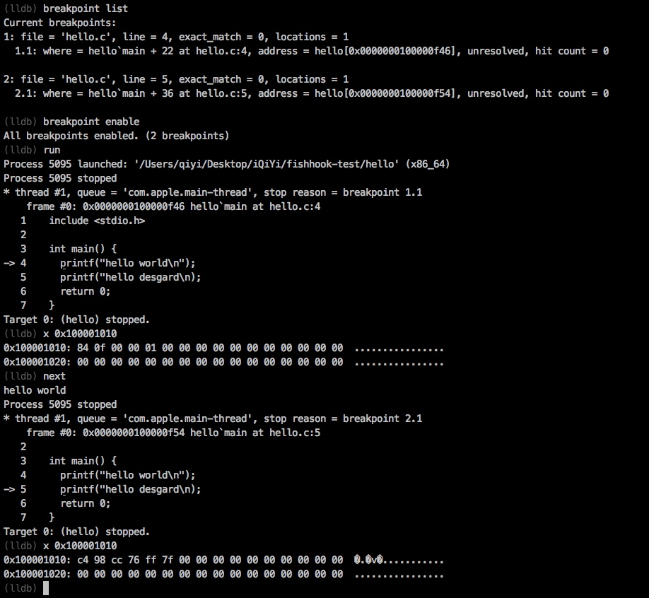

为什么这里要观测 `0x10001010` 这个地址？因为 `imp___stubs__printf` 这个指针指向了它。这说明在 `__la_symbol_ptr` 表中对其进行了记录。使用 *MachOView* 对其进行验证：

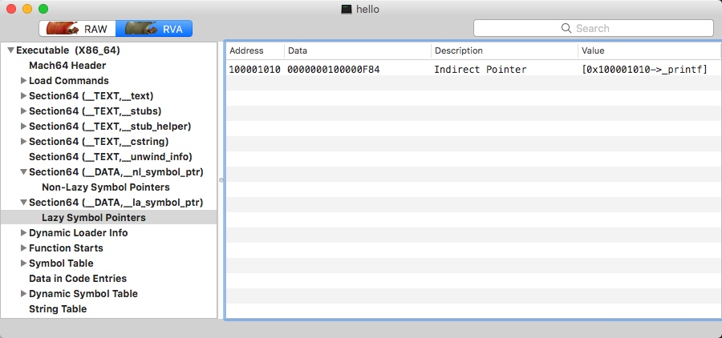

发现在 `__DATA.__la_symbol_ptr` 中的记录值与 *lldb* 中 `x 0x10001010` 命令输出的记录值均为 `01 00 00 0f 84`。这个值对应的地址就是 `imp___stubs__printf` 这个桩位置。

```c
0x100000f84         push       0x0
0x100000f89         jmp        0x100000f74
```

```c
; Section __stub_helper
0x100000f74         lea        r11, qword [dyld_stub_binder_100001000+8]   ; CODE XREF=0x100000f89
0x100000f7b         push       r11
0x100000f7d         jmp        qword [dyld_stub_binder_100001000]          ; dyld_stub_binder
0x100000f83         db         0x90
0x100000f84         push       0x0
0x100000f89         jmp        0x100000f74
```

这个位置是不是似曾相识？是的，在[Mach-O 文件格式探索](http://www.desgard.com/iosre-1/)一文中的验证试验，已经试验过了 Stub 机制。说道这里，我们在 MachOView 中的 `__TEXT.__stubs` 这个 Section 对其进行验证：

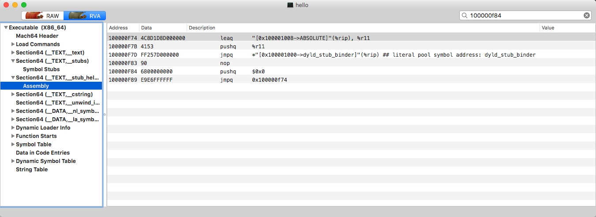

与预想中的结果是相同的。这个在 `__TEXT.__stub_helper` 中解析出的汇编代码和 *Hopper* 中完全一致。在这里通过 `_stub_helper` 来调用 `dyld_stu_binder` 方法计算 `printf` 函数的真实地址。其具体信息可以看出，`jmpq 0x100000f74` 就是在 `pushq` 参数 `$0x0` （link 过程中的标记值）后跳转到这个 section 的头部，并调用 `binder` 方法。

`binder` 方法的作用简单来讲就是计算对应的函数地址进行绑定，之后进而调用对应函数。

在第二次输出 `0x10001010` 的值的时候，发现与第一次的值不相同了。变成了 `7f ff 76 cc 98 c4`。这个地址其实就是 `printf` 的真实地址。通过 `x` 命令及方法名的方式进行验证：

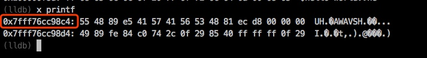

也就是说 `__DATA.__la_symbol_ptr` 中指向 `printf` 地址的值已经发生了改变，并真正的指向了 `printf` 指令。

### Dynamic Symbol Table

**Dynamic Symbol Table** 动态符号表是用来加载动态库的时候导出的符号表，该表在 dyld 时期使用，并且在对象被加载的时候映射到进程的地址空间。所以我们可以说 DST 是符号表的子集。对于 ELF 来讲，DST 是有其定义的；但是对于 Mach-O 来说，我们可以理解为 DST 就是 **Symbol Stubs**。DST 和 Mach-O 中的 *Indirect Addressing* 有很大的关联，这里给出 Apple 对于 *Indirect Addressing* 的[官方文档] (https://developer.apple.com/library/content/documentation/DeveloperTools/Conceptual/MachOTopics/1-Articles/indirect_addressing.html)。

这个文档的主要内容是介绍了 *Non-lazy symbol references*、*Lazy symbol reference* 的特点和区别。其中 *Lazy symbol reference* 是指在方法在第一次调用的时候，会根据 dyld 过程时加载的映射地址进行处理，完成绑定操作。

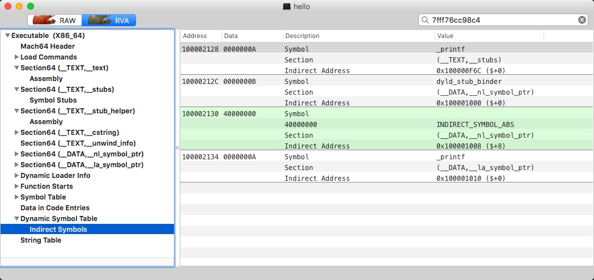

【通过 MachOView 我们可以查看 **Dynamic Symbol Table** 中的所有 *Indirect Symbol*】

## 理解 fishhook

### 明确思路

根据上面的实战内容，我们理解了 Lazy Binding 这个过程。受此启发，我们是不是可以重新绑定 Mach-O 的 Symbol 从而 hook 一些 C 中的库函数呢？这个思路在 [fishhook](https://github.com/facebook/fishhook) 中已经实现。


### 准备

为了简化分析过程，我们引入了一个例子，之后的分析都会围绕着这个例子来进行。实例代码很简单，就是修改库函数 `strlen`，让其始终返回 `666`。

```c
#include <stdio.h>
#include "fishhook.h"

static int (*original_strlen)(const char *_s);

int new_strlen(const char *_s) {
    return 666;
}

int main(int argc, const char * argv[]) {
    struct rebinding strlen_rebinding = { "strlen", new_strlen,
        (void *)&original_strlen };
    rebind_symbols((struct rebinding[1]){ strlen_rebinding }, 1);
    char *str = "hellolazy";
    
    printf("%d\n", strlen(str));
    return 0;
}
```

在 `main` 方法中，我们构造了一个 `rebinding` 结构体实例，使用**原方法名**、**新方法的指针**以及**一个二阶指针**（后面我们可以了解到这里存储了 `__bss` 段中原方法的地址）。

```c
struct rebinding {
    const char *name;		// 原方法名
    void *replacement;		// 新方法的代码段首地址
    void **replaced;		// 旧方法的指针
};
```

在跟踪代码之前，我先使用 `nm` 命令对生成的执行文件查看 File 中的符号信息（ `-n` 参数是根据已知地址进行排序）：

```c
$ nm -n TestObjcProj
                 U ___memcpy_chk
                 U __dyld_get_image_header
                 U __dyld_get_image_vmaddr_slide
                 U __dyld_image_count
                 U __dyld_register_func_for_add_image
                 U _dladdr
                 U _free
                 U _malloc
                 U _printf
                 U _strcmp
                 U _strlen
                 U _strnlen
                 U dyld_stub_binder
0000000100000000 T __mh_execute_header
0000000100000690 t _rebind_symbols_image
00000001000006f0 t _prepend_rebindings
00000001000007d0 t _rebind_symbols_for_image
0000000100000b00 t _rebind_symbols
0000000100000bc0 t __rebind_symbols_for_image
0000000100000bf0 t _perform_rebinding_with_section
0000000100000e10 T _new_strlen
0000000100000e20 T _main
0000000100001090 b __rebindings_head
0000000100001098 b _original_strlen
```

这里每一行代表一个符号，三列值分别代表**地址**，**符号说明** 和 **符号名**。其中符号说明为以下规则：

* 小写代表作用域为 *Local*，大写代表符号是 *Global(external)* 的。
* `A` - 符号值是绝对的，在链接过程中不允许对其改变，这个符号常常出现在**中断向量表**中。
* `B` - 符号值出现在内存 *BSS* 段。例如在某一个文件中定义全局的 *static* 方法 `static void test`，则符号 *test* 的类型为 `b`，切存储于 *BSS* 中。其值为该符号在 *BSS* 中的偏移。一般来说，*BSS* 分配在 RAM 中。
* `C` - 称为**Common Symbol** **一般符号**，是为初始化的数据段。该符号不包含于普通的 Section 中。只有在链接过程才会进行分配。符号的值为所需要的字节数。
* `D` - 称之为 **Data Symbol**。位于初始化数据段中。一般分配到 *Data Section* 中。例如全局的 `int table[5] = {233, 123, 321, 132, 231};`，会分配到初始化数据段中。
* `T` - 该符号位于代码区 *TS* 中。
* `U` - 说明**当前文件中该符号是未定义的，该符号的定义在别的文件中**。

我们找到这几个与 `strlen` 先关的符号，先记录下来：

```c
                 U _strlen	# 系统库方法，dyld 动态加载，所以未定义
0000000100000e10 T _new_strlen  # 自定义方法，位于 Text Section
0000000100001098 b _original_strlen  # 
```


另外我们还需要了解的一些基地址信息。例如：**Lazy Symbol Pointer Table**(`__DATA.__la_symbol_ptr`)、**Indirect Symbol Table**、**Symbol Table**。这些均能从 *MachOView* 中获得到。

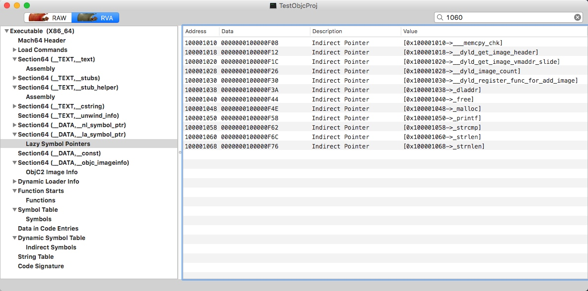

获取到 `__DATA.__la_symbol_ptr` 基地址为 `0x100001010`。

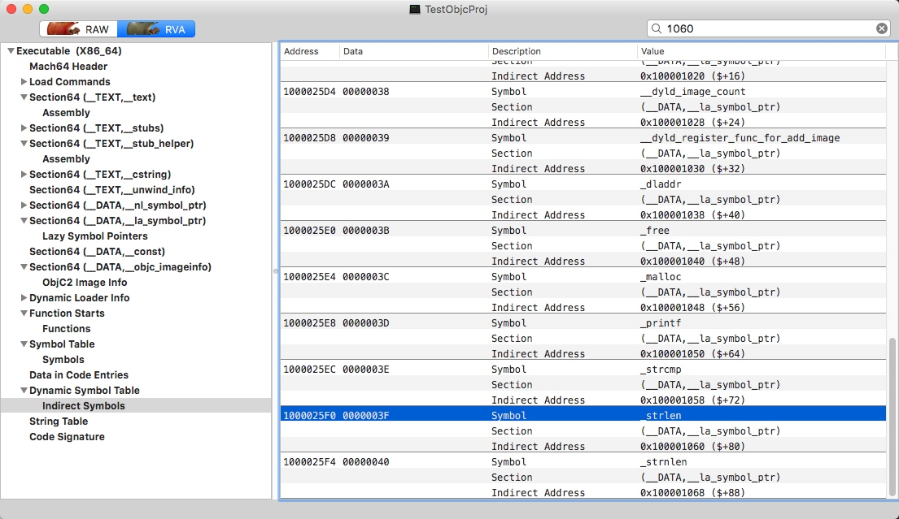

这里获取到在 **Indirect Symbols** 中，`_strlen` 符号的地址为 `0x1000025f0`。

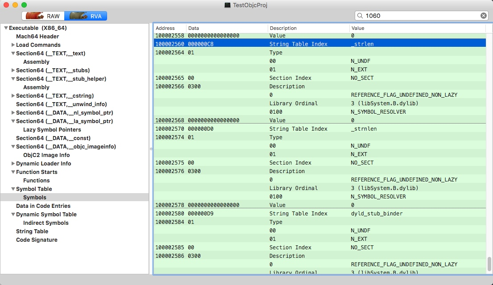

这里可以获取到在 **Symbol Table** 中对应的符号位置 `0x100002560`，而且其中还能检索到在 **String Table** 中对应的符号 `_strlen` 的符号名称。

### 调试代码

在进行 hook 的代码逻辑中，在声明一个 `strlen_rebinding` 实例之后，需要手动调用方法 `rebind_symbols` ，其中需要传入一个 `rebinding` 数组的头地址，以及其 *size*。下面来看一下 `rebind_symbols` 方法的实现：

```c
#define __SIZE_TYPE__ long unsigned int
typedef __SIZE_TYPE__ size_t;
/**
 * rebind_symbols
 * struct rebinding rebindings[] - rebinding 结构体数组
 * size_t rebindings_nel - 数组长度
 */
int rebind_symbols(struct rebinding rebindings[], size_t rebindings_nel) {
    // 维护一个 rebindings_entry 的结构
    // 将 rebinding 的多个实例组织成一个链表
    int retval = prepend_rebindings(&_rebindings_head, rebindings, rebindings_nel);
    // 判断是否 malloc 失败，失败会返回 -1
    if (retval < 0) {
        return retval;
    }
    // _rebindings_head -> next 是第一次调用的标志符，NULL 则代表第一次调用
    if (!_rebindings_head->next) {
        // 第一次调用，将 _rebind_symbols_for_image 注册为回调
        _dyld_register_func_for_add_image(_rebind_symbols_for_image);
    } else {
        // 先获取 dyld 镜像数量
        uint32_t c = _dyld_image_count();
        for (uint32_t i = 0; i < c; i++) {
            // 根据下标依次进行重绑定过程
            _rebind_symbols_for_image(_dyld_get_image_header(i), _dyld_get_image_vmaddr_slide(i));
        }
    }
    // 返回状态值
    return retval;
}
```

为了**将多次绑定时的多个符号**组织成一个链式结构，*fishhook* 自定义了一个链表结构来组织这个逻辑，其中每个节点的数据结构如下：

```c
struct rebindings_entry {
    struct rebinding *rebindings; // rebinding 数组实例
    size_t rebindings_nel; // 元素数量
    struct rebindings_entry *next; // 链表索引
};

// 全局量，直接拿出表头
static struct rebindings_entry *_rebindings_head;
```

在 `prepend_rebindings` 方法中，*fishhook* 会维护这个结构：

```c
/**
 * prepend_rebindings 用于 rebindings_entry 结构的维护
 * struct rebindings_entry **rebindings_head - 对应的是 static 的 _rebindings_head
 * struct rebinding rebindings[] - 传入的方法符号数组
 * size_t nel - 数组对应的元素数量
 */
static int prepend_rebindings(struct rebindings_entry **rebindings_head,
                              struct rebinding rebindings[],
                              size_t nel) {
    // 声明 rebindings_entry 一个指针，并为其分配空间
    struct rebindings_entry *new_entry = (struct rebindings_entry *) malloc(sizeof(struct rebindings_entry));
    // 分配空间失败的容错处理
    if (!new_entry) {
        return -1;
    }
    // 为链表中元素的 rebindings 实例分配指定空间
    new_entry->rebindings = (struct rebinding *) malloc(sizeof(struct rebinding) * nel);
    // 分配空间失败的容错处理
    if (!new_entry->rebindings) {
        free(new_entry);
        return -1;
    }
    // 将 rebindings 数组中 copy 到 new_entry -> rebingdings 成员中
    memcpy(new_entry->rebindings, rebindings, sizeof(struct rebinding) * nel);
    // 为 new_entry -> rebindings_nel 赋值
    new_entry->rebindings_nel = nel;
    // 为 new_entry -> newx 赋值，维护链表结构
    new_entry->next = *rebindings_head;
    // 移动 head 指针，指向表头
    *rebindings_head = new_entry;
    return 0;
}
```

之后这一部分的结构将会持续被维护，用图示来说明一下：

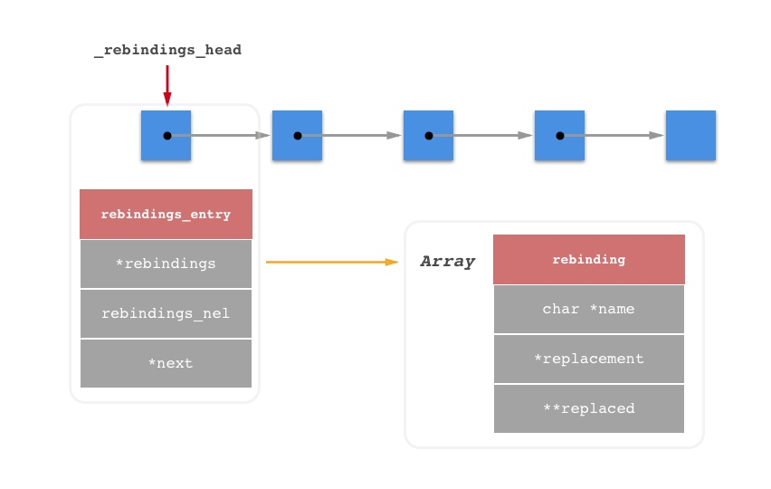

在执行完链表的初始化及结构维护的 `prepend_rebindings` 方法，继续执行。由于我们的 `strlen` 是 dyld 加载的系统库方法，所以 `_rebindings_head -> next` 在第一次调用的时候为空，因为没有做过替换符号，所以会调用 `_dyld_register_func_for_add_image` 来注册 `_rebind_symbols_for_image` 方法，之后程序每次加载动态库的时候，都会去调用该方法。如果不是第一次替换符号，则**遍历已经加载的动态库**。

这一块的流程也是 *fishhook* 代码的精髓部分，逐一来分析这些地方。

#### `_dyld_register_func_for_add_image` 是什么？

这里笔者查看了 Apple 官方的 `dyld.h` 头文件，其中对于 `_dyld_register_func_for_add_image` 有较为详细的说明（[dyld.h](https://opensource.apple.com/source/dyld/dyld-433.5/include/mach-o/dyld.h.auto.html)）：

> The following functions allow you to install callbacks which will be called by dyld whenever an image is loaded or unloaded.  During a call to _dyld_register_func_for_add_image() the callback func is called for every existing image.  Later, it is called as each new image is loaded and bound (but initializers not yet run).  The callback registered with _dyld_register_func_for_remove_image() is called after any terminators in an image are run and before the image is un-memory-mapped.

`_dyld_register_func_for_add_image` 这个方法当镜像 *Image* 被 *load* 或是 *unload* 的时候都会由 dyld 主动调用。当该方法被触发时，会为每个镜像触发其回调方法。之后则将其镜像与其回电函数进行绑定（但是未进行初始化）。使用 `_dyld_register_func_for_add_image` 注册的回调将在镜像中的 terminators 启动后被调用。

#### 为什么传入的 `_rebind_symbols_for_image` 作为回调函数呢？

```c
extern void _dyld_register_func_for_add_image(void (*func)(const struct mach_header* mh, intptr_t vmaddr_slide))    __OSX_AVAILABLE_STARTING(__MAC_10_1, __IPHONE_2_0);
extern void _dyld_register_func_for_remove_image(void (*func)(const struct mach_header* mh, intptr_t vmaddr_slide)) __OSX_AVAILABLE_STARTING(__MAC_10_1, __IPHONE_2_0);
```

`extern` 关键字来告知编译器**当调用方法的时候，请在其他模块中寻找该方法定义**。并且在这两个方法的声明中，所注册方法的参数列表一定是 `(const struct mach_header* mh, intptr_t vmaddr_slide)`。

```c
/**
 * _rebind_symbols_for_image 是 rebind_symbols_for_image 的一个入口方法
 * 这个入口方法存在的意义是满足 _dyld_register_func_for_add_image 传入回调方法的格式
 * header - Mach-O 头
 * slide - intptr_t 持有指针
 */
static void _rebind_symbols_for_image(const struct mach_header *header,
                                      intptr_t slide) {
    // 外层是一个入口函数，意在调用有效的方法 rebind_symbols_for_image
    rebind_symbols_for_image(_rebindings_head, header, slide);
}
```

看到 `_rebind_symbols_for_image` 是个入口，我们的问题也就迎刃而解了。添加这个入口方法其实是为了适应回调函数的参数格式，但是真正调用的 `rebind_symbols_for_image` 所需要的参数不满足其方法的描述。

#### `intptr_t` 是什么类型？

至于 `intptr_t`，笔者在之前阅读 [*Understanding and using C pointers*](https://book.douban.com/subject/25827246/) 时见过。下面为引用：

```c
/// /usr/include/stdint.h

/* Types for `void *' pointers. */
#if __WORDSIZE == 64
# ifndef __intptr_t_defined
typedef long int intptr_t;
# define __intptr_t_defined
# endif
typedef unsigned long int uintptr_t;
#else
# ifndef __intptr_t_defined
typedef int intptr_t;
# define __intptr_t_defined
# endif
typedef unsigned int uintptr_t;
#endif
```

> `intptr_t` 和 `uintptr_t` 这两种类型用于存储指针地址。从字面上看，`intptr_t` 像是一个整型指针类型，而且在 `stdint.h` 的注释中也可以看到 *Types for void *pointers* 的描述，但我们看到实际上 `intptr_t` 就是一个整数，在 64 位平台中定义为 `long int`，否则定义为 `int`。我们知道 C 语言的指针实际上就是变量的地址，在 64 位平台上指针为 8 字节，在 32 位平台上指针为 4 字节，而 `intptr_t` 刚好是和这个字节数对应，使用它可以安全地进行整数与指针的转换运算，也就是说当需要将指针作为整数运算时，将它转换成 `intptr_t` 进行运算才是安全的。**使用 `int` 时也可以使用 `intptr_t` 来保证平台的通用性，它在不同的平台上编译时长度不同，但都是标准的平台字长**。

简而言之，这是一个标准字长的存储量，用来代表方法地址的偏移量。

### 重绑定寻址 - 基址准备过程

`rebind_symbols_for_image` 方法描述的也就是整个 *fishhook* 精华所在 - **重绑定符号过程**。继续跟踪代码来理解每一行的意图：

```c
static void rebind_symbols_for_image(struct rebindings_entry *rebindings,
                                     const struct mach_header *header,
                                     intptr_t slide) {
    Dl_info info;
    if (dladdr(header, &info) == 0) {
        return;
    }

    // 声明几个查找量:
    // linkedit_segment, symtab_command, dysymtab_command
    segment_command_t *cur_seg_cmd;
    segment_command_t *linkedit_segment = NULL;
    struct symtab_command* symtab_cmd = NULL;
    struct dysymtab_command* dysymtab_cmd = NULL;
    
    // 初始化游标
    // header = 0x100000000 - 二进制文件基址默认偏移
    // sizeof(mach_header_t) = 0x20 - Mach-O Header 部分
    // 首先需要跳过 Mach-O Header
    uintptr_t cur = (uintptr_t)header + sizeof(mach_header_t);
    // 遍历每一个 Load Command，游标每一次偏移每个命令的 Command Size 大小
    // header -> ncmds: Load Command 加载命令数量
    // cur_seg_cmd -> cmdsize: Load 大小
    for (uint i = 0; i < header->ncmds; i++, cur += cur_seg_cmd->cmdsize) {
        // 取出当前的 Load Command
        cur_seg_cmd = (segment_command_t *)cur;
        // Load Command 的类型是 LC_SEGMENT
        if (cur_seg_cmd->cmd == LC_SEGMENT_ARCH_DEPENDENT) {
            // 比对一下 Load Command 的 name 是否为 __LINKEDIT
            if (strcmp(cur_seg_cmd->segname, SEG_LINKEDIT) == 0) {
                // 检索到 __LINKEDIT
                linkedit_segment = cur_seg_cmd;
            }
        }
        // 判断当前 Load Command 是否是 LC_SYMTAB 类型
        // LC_SEGMENT - 代表当前区域链接器信息
        else if (cur_seg_cmd->cmd == LC_SYMTAB) {
            // 检索到 LC_SYMTAB
            symtab_cmd = (struct symtab_command*)cur_seg_cmd;
        }
        // 判断当前 Load Command 是否是 LC_DYSYMTAB 类型
        // LC_DYSYMTAB - 代表动态链接器信息区域
        else if (cur_seg_cmd->cmd == LC_DYSYMTAB) {
            // 检索到 LC_DYSYMTAB
            dysymtab_cmd = (struct dysymtab_command*)cur_seg_cmd;
        }
    }
    
    // 容错处理
    if (!symtab_cmd || !dysymtab_cmd || !linkedit_segment ||
        !dysymtab_cmd->nindirectsyms) {
        return;
    }
    
    // slide: ASLR 偏移量
    // vmaddr: SEG_LINKEDIT 的虚拟地址
    // fileoff: SEG_LINKEDIT 地址偏移
    // 式①：base = SEG_LINKEDIT真实地址 - SEG_LINKEDIT地址偏移
    // 式②：SEG_LINKEDIT真实地址 = SEG_LINKEDIT虚拟地址 + ASLR偏移量
    // 将②代入①：Base = SEG_LINKEDIT虚拟地址 + ASLR偏移量 - SEG_LINKEDIT地址偏移
    uintptr_t linkedit_base = (uintptr_t)slide + linkedit_segment->vmaddr - linkedit_segment->fileoff;
    // 通过 base + symtab 的偏移量 计算 symtab 表的首地址，并获取 nlist_t 结构体实例
    nlist_t *symtab = (nlist_t *)(linkedit_base + symtab_cmd->symoff);
    // 通过 base + stroff 字符表偏移量计算字符表中的首地址，获取字符串表
    char *strtab = (char *)(linkedit_base + symtab_cmd->stroff);
    // 通过 base + indirectsymoff 偏移量来计算动态符号表的首地址
    uint32_t *indirect_symtab = (uint32_t *)(linkedit_base + dysymtab_cmd->indirectsymoff);
    
    // 归零游标，复用
    cur = (uintptr_t)header + sizeof(mach_header_t);
    // 再次遍历 Load Commands
    for (uint i = 0; i < header->ncmds; i++, cur += cur_seg_cmd->cmdsize) {
        cur_seg_cmd = (segment_command_t *)cur;
        // Load Command 的类型是 LC_SEGMENT
        if (cur_seg_cmd->cmd == LC_SEGMENT_ARCH_DEPENDENT) {
            // 查询 Segment Name 过滤出 __DATA 或者 __DATA_CONST
            if (strcmp(cur_seg_cmd->segname, SEG_DATA) != 0 &&
                strcmp(cur_seg_cmd->segname, SEG_DATA_CONST) != 0) {
                continue;
            }
            // 遍历 Segment 中的 Section
            for (uint j = 0; j < cur_seg_cmd->nsects; j++) {
                // 取出 Section
                section_t *sect = (section_t *)(cur + sizeof(segment_command_t)) + j;
                // flags & SECTION_TYPE 通过 SECTION_TYPE 掩码获取 flags 记录类型的 8 bit
                // 如果 section 的类型为 S_LAZY_SYMBOL_POINTERS
                // 这个类型代表 lazy symbol 指针 Section
                if ((sect->flags & SECTION_TYPE) == S_LAZY_SYMBOL_POINTERS) {
                    // 进行 rebinding 重写操作
                    perform_rebinding_with_section(rebindings, sect, slide, symtab, strtab, indirect_symtab);
                }
                // 这个类型代表 non-lazy symbol 指针 Section
                if ((sect->flags & SECTION_TYPE) == S_NON_LAZY_SYMBOL_POINTERS) {
                    perform_rebinding_with_section(rebindings, sect, slide, symtab, strtab, indirect_symtab);
                }
            }
        }
    }
}
```

`rebind_symbols_for_image` 方法展示了冲绑定过程中，所有计算地址的流程。浏览过代码之后思考一个问题：**为了完成重绑定的操作，我们需要获取哪些地址信息呢？**

#### 1. 获取 Linkedit Base Addr 

*fishhook* 绝大多数重要的地址计算都要使用到或是间接使用到 **Linkedit Base Addr**。要如何理解这个基地址呢？这里我们可以理解成： **Linkedit Segment 在文件中的首地址**。

为什么 *Linkedit Segment* 首地址信息十分重要，因为在 *Load Command* 中，`LC_SYMTAB` 和 `LC_DYSYMTAB` 的中所记录的 Offset 都是基于 **__LINKEDIT** 段的。而 `LC_SYMTAB` 中通过偏移量可以拿到**symtab 符号表首地址**、**strtab 符号名称字符表首地址**以及**indirect_symtab 跳转表首地址**。

我们拿到 **Indirect Symbols** 的首地址 `indirect_symtab` 再加上 `LC_SEGMENT.__DATA` 中任何一个 *Section* 信息的 `reverved1` 字段就可以获取到对应的 *Indirect Address* 信息。在这之后我们可以遍历每一个 **Indirect Symbols**，并以索引方式获取到每一个 `nlist` 结构的符号，从符号中获取到符号名字符串在字符表中的偏移量，进而继续获取符号名。

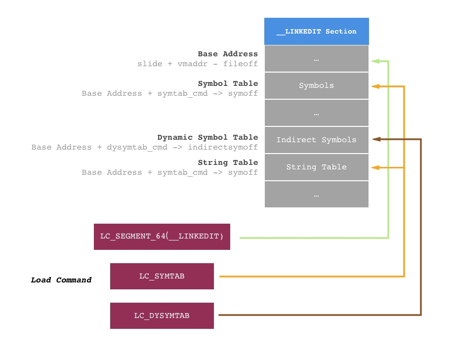


#### 2. 二次遍历 Load Command 的目的

第一次遍历的目的在第一个疑问中已经解释的很清楚了，遍历目的有三个，为了找出 `LC_SEGMENT(__LINKEDIT)`、`LC_SYMTAB` 和 `LC_DYSYMTAB` 三个 **Load Command**，从而我们可以计算出 *Base Address*、*Symbol Table*、*Dynamic Symbol* 和 *String Table* 的位置。

而在第二次遍历中，我们需要获取的是 `LC_SEGMENT(__DATA)` 中 `__nl_symbol_ptr` 和 `__la_symbol_ptr` 这两个 *Section*。其目的是为了确定 **lazy binding指针表** 和 **non lazy binding指针表** 在 *Dynamic Symbol* 中对应的位置，方法就是获取到 *reserved1* 字段。这个在后面我们会做一个验证实现。

### 重绑定

在一切基址准备好之后，开始进行重绑定 `perform_rebinding_with_section` 方法：

```c
static void perform_rebinding_with_section(struct rebindings_entry *rebindings,
                                           section_t *section,
                                           intptr_t slide,
                                           nlist_t *symtab,
                                           char *strtab,
                                           uint32_t *indirect_symtab) {
    // 在 Indirect Symbol 表中检索到对应位置
    uint32_t *indirect_symbol_indices = indirect_symtab + section->reserved1;
    // 获取 _DATA.__nl_symbol_ptr(或__la_symbol_ptr) Section
    // 已知其 value 是一个指针类型，整段区域用二阶指针来获取
    void **indirect_symbol_bindings = (void **)((uintptr_t)slide + section->addr);
    // 用 size / 一阶指针来计算个数，遍历整个 Section
    for (uint i = 0; i < section->size / sizeof(void *); i++) {
        // 通过下标来获取每一个 Indirect Address 的 Value
        // 这个 Value 也是外层寻址时需要的下标
        uint32_t symtab_index = indirect_symbol_indices[i];
        if (symtab_index == INDIRECT_SYMBOL_ABS || symtab_index == INDIRECT_SYMBOL_LOCAL ||
            symtab_index == (INDIRECT_SYMBOL_LOCAL   | INDIRECT_SYMBOL_ABS)) {
            continue;
        }
        // 获取符号名在字符表中的偏移地址
        uint32_t strtab_offset = symtab[symtab_index].n_un.n_strx;
        // 获取符号名
        char *symbol_name = strtab + strtab_offset;
        // 过滤掉符号名小于 4 位的符号
        if (strnlen(symbol_name, 2) < 2) {
            continue;
        }
        // 取出 rebindings 结构体实例数组，开始遍历链表
        struct rebindings_entry *cur = rebindings;
        while (cur) {
            // 对于链表中每一个 rebindings 数组的每一个 rebinding 实例
            // 依次在 String Table 匹配符号名
            for (uint j = 0; j < cur->rebindings_nel; j++) {
                // 符号名与方法名匹配
                if (strcmp(&symbol_name[1], cur->rebindings[j].name) == 0) {
                    // 如果是第一次对跳转地址进行重写
                    if (cur->rebindings[j].replaced != NULL &&
                        indirect_symbol_bindings[i] != cur->rebindings[j].replacement) {
                        // 记录原始跳转地址
                        *(cur->rebindings[j].replaced) = indirect_symbol_bindings[i];
                    }
                    // 重写跳转地址
                    indirect_symbol_bindings[i] = cur->rebindings[j].replacement;
                    // 完成后不再对当前 Indirect Symbol 处理
                    // 继续迭代到下一个 Indirect Symbol
                    goto symbol_loop;
                }
            }
            // 链表遍历
            cur = cur->next;
        }
    symbol_loop:;
    }
}
```

这段方法主要描述了替换 `__DATA.__la_symbol_ptr` 和 `__DATA.__la_symbol_ptr` 的 *Indirect Pointer* 主要过程。从 `reserved1` 字段获取到 *Indirect Symbols* 对应的位置。从中我们可以获取到指定符号的偏移量，这个偏移量主要用来在 String Table 中检索出符号名称字符串。之后我们找到 `__DATA.__la_symbol_ptr` 和 `__DATA.__la_symbol_ptr` 这两个 Section。这两个表中，都是由 *Indirect Pointer* 构成的指针数组，但是**其中的元素决定了我们调用的方法应该以哪个代码段的方法来执行**。我们遍历这个指针数组中每一个指针，在每一层遍历中取出其符号名称，与我们的 `rebindings` 链表中每一个元素进行比对，当名称匹配的时候，重写其指向地址。

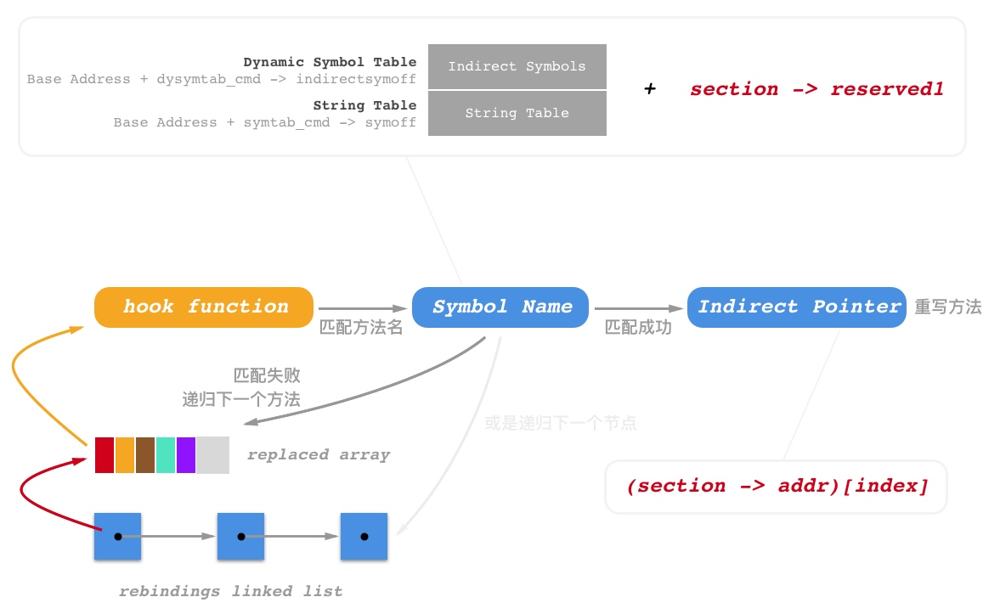

## 小结

以上就是 *fishhook* 的全部源码实现。本文完成了对于 *fishhook* 全部运行时流程进行了详尽的分析。在 [验证试验 - 探求 fishhook 原理（二）]() 中，将会对 *fishhook* 的全部流程以计算的方式进行模拟实践。并对 *fishhook* 代码中的一些处理和技巧做出一一剖析。尽请期待。


## 引文

* [Linux Tools Quick Tutorial](http://linuxtools-rst.readthedocs.io/zh_CN/latest/)
* [Hook 原理之 fishhook 源码解析](https://amywushu.github.io/2017/02/27/%E6%BA%90%E7%A0%81%E5%AD%A6%E4%B9%A0-Hook-%E5%8E%9F%E7%90%86%E4%B9%8B-fishhook-%E6%BA%90%E7%A0%81%E8%A7%A3%E6%9E%90.html)

## 鸣谢

感谢 [AloneMonkey](http://www.alonemonkey.com/) 和 [jmpews](http://jmpews.github.io/) 两位大牛对我的一些帮助。


> 若想查看更多的iOS Source Probe文章，收录在这个[Github仓库中](https://github.com/Desgard/iOS-Source-Probe)。

