> 作者：冬瓜

> 原文链接：[Guardia · 瓜地](http://www.desgard.com/iosre-1/)

# Mach-O 文件格式探索

最近开始研究 iOS 逆向的相关知识，并且使用 [MonkeyDev](https://github.com/AloneMonkey/MonkeyDev/) 对 WeChat 进行了实战。这里我放出后期会持续更新的个人项目 [WeCheat](https://github.com/Desgard/WeCheat)。在逆向专题真正开始之前，需要系统的学习一些软件内幕知识。这篇文章将从二进制格式开始讲起，并探秘 Mach-O 文件格式内容。

## 进程与二进制格式

进程在众多操作系统中都有提及，它是作为一个正在执行的程序的实例，这是 UNIX 的一个基本概念。而进程的出现是特殊文件在内从中加载得到的结果，这种文件必须使用操作系统可以认知的格式，这样才对该文件引入依赖库，初始化运行环境以及顺利地执行创造条件。

**Mach-O**（Mach Object File Format）是 macOS 上的可执行文件格式，类似于 Linux 和大部分 UNIX 的原生格式 **ELF**（Extensible Firmware Interface）。为了更加全面的了解这块内容，我们看一下 macOS 支持的三种可执行格式：解释器脚本格式、通用二进制格式和 Mach-O 格式。

| 可执行格式 | magic | 用途 |
| ------| ------ | ------ |
| 脚本 | `\x7FELF` | 主要用于 shell 脚本，但是也常用语其他解释器，如 Perl, AWK 等。也就是我们常见的脚本文件中在 `#!` 标记后的字符串，即为执行命令的指令方式，以文件的 stdin 来传递命令 |
| 通用二进制格式 | `0xcafebabe` <br />`0xbebafeca` | 包含多种架构支持的二进制格式，只在 macOS 上支持 | 
| Mach-O | `0xfeedface`（32 位）<br /> `0xfeedfacf`（64 位） | macOS 的原生二进制格式 |


### 通用二进制格式（Universal Binary）

这个格式在有些资料中也叫胖二进制格式（Fat Binary），Apple 提出这个概念是为了解决一些历史原因，macOS（更确切的应该说是 OS X）最早是构建于 PPC 架构智商，后来才移植到 Intel 架构（从 Mac OS X Tiger 10.4.7 开始），通用二进制格式的二进制文件可以在 PPC 和 x86 两种处理器上执行。

说到底，通用二进制格式只不过是对多架构的二进制文件的打包集合文件，而 macOS 中的多架构二进制文件也就是适配不同架构的 Mach-O 文件。

**Fat Header** 的数据结构在 `<mach-o/fat.h>` 头文件中有定义，可以参看 `/usr/include/mach-o/fat.h` 找到定义头：

```c
#define FAT_MAGIC	0xcafebabe
#define FAT_CIGAM	0xbebafeca	/* NXSwapLong(FAT_MAGIC) */

struct fat_header {
	uint32_t	magic;		/* FAT_MAGIC 或 FAT_MAGIC_64 */
	uint32_t	nfat_arch;	/* 结构体实例的个数 */
};

struct fat_arch {
	cpu_type_t	cputype;	/* cpu 说明符 (int) */
	cpu_subtype_t	cpusubtype;	/* 指定 cpu 确切型号的整数 (int) */
	uint32_t	offset;		/* CPU 架构数据相对于当前文件开头的偏移值 */
	uint32_t	size;		/* 数据大小 */
	uint32_t	align;		/* 数据内润对其边界，取值为 2 的幂 */
};
```

对于 `cputype` 和 `cpusubtype` 两个字段这里不讲述，可以参看 `/usr/include/mach/machine.h` 头中对其的定义，另外 [Apple 官方文档](https://developer.apple.com/documentation/kernel/mach_header?language=objc)中也有简单的描述。

在 `fat_header` 中，`magic` 也就是我们之前在表中罗列的 *magic* 标识符，也可以类比成 UNIX 中 ELF 文件的 *magic* 标识。加载器会通过这个符号来判断这是什么文件，通用二进制的 *magic* 为 `0xcafebabe`。`nfat_arch` 字段指明当前的通用二进制文件中包含了多少个不同架构的 Mach-O 文件。`fat_header` 后会跟着多个 `fat_arch`，并与多个 Mach-O 文件及其描述信息（文件大小、CPU 架构、CPU 型号、内存对齐方式）相关联。

这里可以通过 `file` 命令来查看简要的架构信息，这里以 iOS 平台 WeChat 4.5.1 版本为例：

```
~ file Desktop/WeChat.app/WeChat
Desktop/WeChat.app/WeChat: Mach-O universal binary with 2 architectures: [arm_v7: Mach-O executable arm_v7] [arm64]
Desktop/WeChat.app/WeChat (for architecture armv7):	Mach-O executable arm_v7
Desktop/WeChat.app/WeChat (for architecture arm64):	Mach-O 64-bit executable arm64
```

进一步，也可以使用 `otool` 工具来打印其 `fat_header` 详细信息：

```
~ otool -f -V Desktop/WeChat.app/WeChat
Fat headers
fat_magic FAT_MAGIC
nfat_arch 2
architecture armv7
    cputype CPU_TYPE_ARM
    cpusubtype CPU_SUBTYPE_ARM_V7
    capabilities 0x0
    offset 16384
    size 56450224
    align 2^14 (16384)
architecture arm64
    cputype CPU_TYPE_ARM64
    cpusubtype CPU_SUBTYPE_ARM64_ALL
    capabilities 0x0
    offset 56475648
    size 64571648
    align 2^14 (16384)
```

之后我们用 *Synalyze It!* 来查看 WeChat 的 Mach64 Header 的效果：

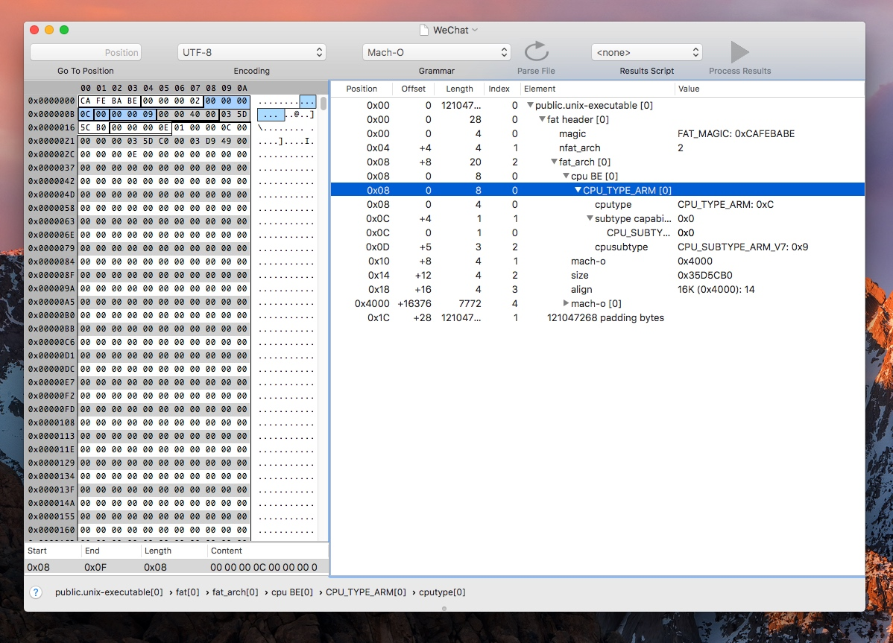

* 从第一个段中得到 `magic = 0xcafebabe` ，说明是 `FAT_MAGIC`。
* 第二段中所存储的字段为 `nfat_arch = 0x00000002`，说明该 App 中包含了两种 CPU 架构。
* 后续的则是 `fat_arch` 结构体中的内容，`cputype(0x0000000c)`、`cpusubtype(0x00000009)`、`offset(0x00004000)`、`size(0x03505C00)` 等等。需要臧帅闯是如果只含有一种 CPU 架构，是没有 fat 头定义的，这部分则可跳过，从而直接过去 `arch` 数据。

## Mach-O 文件格式

由上所知一个通用二进制格式包含了很多个 Mach-O 文件格式，下面我们来具体说说这个格式。Mach-O 文件格式在官方文档中有一个描述图，是很多教程中都引用到的，我重新绘制了一版更清晰的：

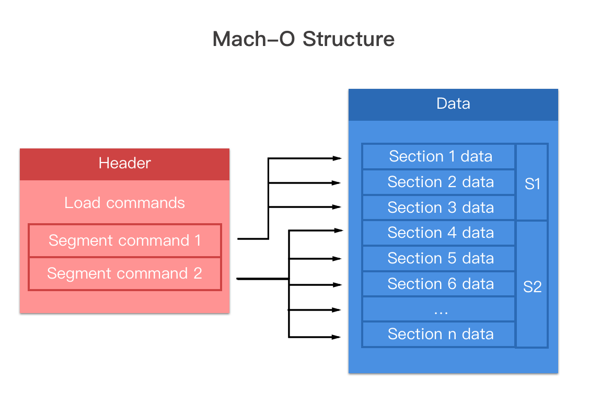
可以看的出 Mach-O 主要由 3 部分组成:

* Mach-O 头（Mach Header）：这里描述了 Mach-O 的 CPU 架构、文件类型以及加载命令等信息；
* 加载命令（Load Command）：描述了文件中数据的具体组织结构，不同的数据类型使用不同的加载命令表示；
* 数据区（Data）：Data 中每一个段（Segment）的数据都保存在此，段的概念和 ELF 文件中段的概念类似，都拥有一个或多个 Section ，用来存放数据和代码。

### Mach-O 头

与 Mach-O 文件格式有关的结构体定义都可以从 `/usr/include/mach-o/loader.h` 中找到，也就是 `<mach-o/loader.h>` 头。以下只给出 64 位定义的代码，因为 32 位的区别是缺少了一个预留字段：

```c
#define	MH_MAGIC	0xfeedface	/* the mach magic number */
#define MH_CIGAM	0xcefaedfe	/* NXSwapInt(MH_MAGIC) */

struct mach_header_64 {
	uint32_t	magic;		/* mach magic 标识符 */
	cpu_type_t	cputype;	/* CPU 类型标识符，同通用二进制格式中的定义 */
	cpu_subtype_t	cpusubtype;	/* CPU 子类型标识符，同通用二级制格式中的定义 */
	uint32_t	filetype;	/* 文件类型 */
	uint32_t	ncmds;		/* 加载器中加载命令的条数 */
	uint32_t	sizeofcmds;	/* 加载器中加载命令的总大小 */
	uint32_t	flags;		/* dyld 的标志 */
	uint32_t	reserved;	/* 64 位的保留字段 */
};
```

由于 Mach-O 支持多种类型文件，所以此处引入了 `filetype` 字段来标明，这些文件类型定义在 `loader.h` 文件中同样可以找到。

```c
#define	MH_OBJECT	0x1		/* Target 文件：编译器对源码编译后得到的中间结果 */
#define	MH_EXECUTE	0x2		/* 可执行二进制文件 */
#define	MH_FVMLIB	0x3		/* VM 共享库文件（还不清楚是什么东西） */
#define	MH_CORE		0x4		/* Core 文件，一般在 App Crash 产生 */
#define	MH_PRELOAD	0x5		/* preloaded executable file */
#define	MH_DYLIB	0x6		/* 动态库 */
#define	MH_DYLINKER	0x7		/* 动态连接器 /usr/lib/dyld */
#define	MH_BUNDLE	0x8		/* 非独立的二进制文件，往往通过 gcc-bundle 生成 */
#define	MH_DYLIB_STUB	0x9		/* 静态链接文件（还不清楚是什么东西） */
#define	MH_DSYM		0xa		/* 符号文件以及调试信息，在解析堆栈符号中常用 */
#define	MH_KEXT_BUNDLE	0xb		/* x86_64 内核扩展 */
```

另外在 `loader.h` 中还可以找到 `flags` 中所取值的全部定义，这里只介绍常用的：

```c
#define	MH_NOUNDEFS	0x1		/* Target 文件中没有带未定义的符号，常为静态二进制文件 */
#define MH_SPLIT_SEGS	0x20  /* Target 文件中的只读 Segment 和可读写 Segment 分开  */
#define MH_TWOLEVEL	0x80		/* 该 Image 使用二级命名空间(two name space binding)绑定方案 */
#define MH_FORCE_FLAT	0x100 /* 使用扁平命名空间(flat name space binding)绑定（与 MH_TWOLEVEL 互斥） */
#define MH_WEAK_DEFINES	0x8000 /* 二进制文件使用了弱符号 */
#define MH_BINDS_TO_WEAK 0x10000 /* 二进制文件链接了弱符号 */
#define MH_ALLOW_STACK_EXECUTION 0x20000/* 允许 Stack 可执行 */
#define	MH_PIE 0x200000  /* 对可执行的文件类型启用地址空间 layout 随机化 */
#define MH_NO_HEAP_EXECUTION 0x1000000 /* 将 Heap 标记为不可执行，可防止 heap spray 攻击 */
```

Mach-O 文件头主要目的是为加载命令提供信息。加载命令过程紧跟在头之后，并且 `ncmds` 和 `sizeofcmds` 来能个字段将会用在加载命令的过程中。

### Mach-O Data

加载命令在 Mach-O 文件加载解析时，会被内核加载器或者动态链接器调用。这些指令都采用 `Type-Size-Value` 这种格式，即：32 位的 `cmd` 值（表示类型），32 位的 `cmdsize` 值（32 位二级制位 4 的倍数，64 位位 8 的倍数），以及命令本身（由 `cmdsize` 指定的长度）。内核加载器使用的命令可以参看 [xnu 源码](http://unix.superglobalmegacorp.com/xnu/newsrc/bsd/kern/mach_loader.c.html)来学习，其他命令则是由动态链接器处理的。

在正式进入加载命令这一过程之前，先来学习一下 Mach-O 的 Data 区域，其中由 Segment 段和 Section 节组成。先来说 Segment 的组成，以下代码仍旧来自 `loader.h`：

```c
#define	SEG_PAGEZERO	"__PAGEZERO" /* 当时 MH_EXECUTE 文件时，捕获到空指针 */
#define	SEG_TEXT	"__TEXT" /* 代码/只读数据段 */
#define	SEG_DATA	"__DATA" /* 数据段 */
#define	SEG_OBJC	"__OBJC" /* Objective-C runtime 段 */
#define	SEG_LINKEDIT	"__LINKEDIT" /* 包含需要被动态链接器使用的符号和其他表，包括符号表、字符串表等 */
```

进而来看一下 Segment 的数据结构具体是什么样的（同样这里也只放出 64 位的代码，与 32 位的区别就是其中 `uint64_t` 类型的几个字段取代了原先 32 位类型字段）：

```c
struct segment_command_64 { 
	uint32_t	cmd;		/* LC_SEGMENT_64 */
	uint32_t	cmdsize;	/* section_64 结构体所需要的空间 */
	char		segname[16];	/* segment 名字，上述宏中的定义 */
	uint64_t	vmaddr;		/* 所描述段的虚拟内存地址 */
	uint64_t	vmsize;		/* 为当前段分配的虚拟内存大小 */
	uint64_t	fileoff;	/* 当前段在文件中的偏移量 */
	uint64_t	filesize;	/* 当前段在文件中占用的字节 */
	vm_prot_t	maxprot;	/* 段所在页所需要的最高内存保护，用八进制表示 */
	vm_prot_t	initprot;	/* 段所在页原始内存保护 */
	uint32_t	nsects;		/* 段中 Section 数量 */
	uint32_t	flags;		/* 标识符 */
};
```

部分的 Segment （主要指的 `__TEXT` 和 `__DATA`）可以进一步分解为 Section。之所以按照 Segment -> Section 的结构组织方式，是因为在同一个 Segment 下的 Section，可以控制相同的权限，也可以不完全按照 Page 的大小进行内存对其，节省内存的空间。而 Segment 对外整体暴露，在程序载入阶段映射成一个完整的虚拟内存，更好的做到内存对齐（可以继续参考 *OS X & iOS Kernel Programming* 一书的第一章内容）。下面给出 Section 具体的数据结构：

```c
struct section_64 { 
	char		sectname[16];	/* Section 名字 */
	char		segname[16];	/* Section 所在的 Segment 名称 */
	uint64_t	addr;		/* Section 所在的内存地址 */
	uint64_t	size;		/* Section 的大小 */
	uint32_t	offset;		/* Section 所在的文件偏移 */
	uint32_t	align;		/* Section 的内存对齐边界 (2 的次幂) */
	uint32_t	reloff;		/* 重定位信息的文件偏移 */
	uint32_t	nreloc;		/* 重定位条目的数目 */
	uint32_t	flags;		/* 标志属性 */
	uint32_t	reserved1;	/* 保留字段1 (for offset or index) */
	uint32_t	reserved2;	/* 保留字段2 (for count or sizeof) */
	uint32_t	reserved3;	/* 保留字段3 */
};
```

下面列举一些常见的 Section。

| Section | 用途 | 
| ------| ------ | 
| `__TEXT.__text` | 主程序代码 | 
| `__TEXT.__cstring` | C 语言字符串 | 
| `__TEXT.__const` | `const` 关键字修饰的常量 | 
| `__TEXT.__stubs	` | 用于 Stub 的占位代码，很多地方称之为*桩代码*。 |
| `__TEXT.__stubs_helper` | 当 Stub 无法找到真正的符号地址后的最终指向 |
| `__TEXT.__objc_methname` | Objective-C 方法名称 |
| `__TEXT.__objc_methtype` | Objective-C 方法类型 |
| `__TEXT.__objc_classname` | Objective-C 类名称 |
| `__DATA.__data` | 初始化过的可变数据 |
| `__DATA.__la_symbol_ptr` | lazy binding 的指针表，表中的指针一开始都指向 `__stub_helper` |
| `__DATA.nl_symbol_ptr` | 非 lazy binding 的指针表，每个表项中的指针都指向一个在装载过程中，被动态链机器搜索完成的符号 |
| `__DATA.__const` | 没有初始化过的常量 |
| `__DATA.__cfstring` | 程序中使用的 Core Foundation 字符串（`CFStringRefs`） |
| `__DATA.__bss` | BSS，存放为初始化的全局变量，即常说的静态内存分配 |
| `__DATA.__common` | 没有初始化过的符号声明 |
| `__DATA.__objc_classlist` | Objective-C 类列表 |
| `__DATA.__objc_protolist` | Objective-C 原型 |
| `__DATA.__objc_imginfo` | Objective-C 镜像信息 |
| `__DATA.__objc_selfrefs` | Objective-C `self` 引用|
| `__DATA.__objc_protorefs` | Objective-C 原型引用 |
| `__DATA.__objc_superrefs` | Objective-C 超类引用 |

## 验证实验

当了解了 Segment 和 Section 的定义之后，我们可以简单的探索一下 `LC_SEGMENT` 这个命令的过程。用 helloworld 来做个试验：

```c++
/// main.cpp
#import <stdio.h>

int main() {
    printf("hello");
    return 0;
}
```

使用 `clang -g main.cpp -o main` 生成执行文件。然后拖入到 *MachOView* 中来查看一下加载 Segment 的结构（当然使用 *Synalyze It!* 也能捕捉到这些信息的，但是 *MachOView* 更对结构的分层更加一目了然）：

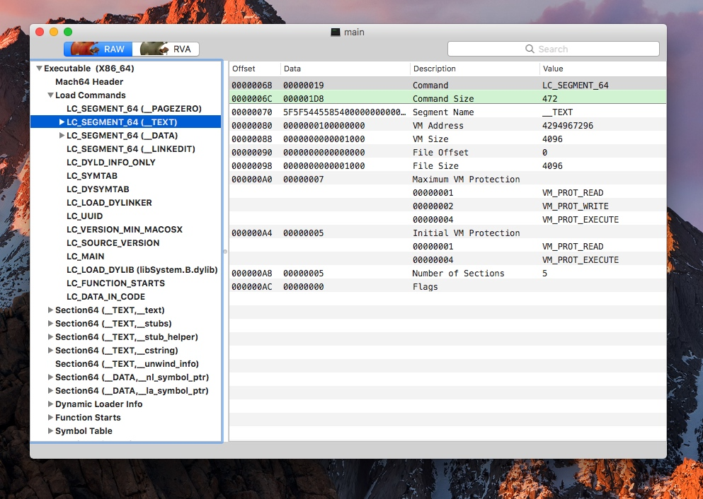


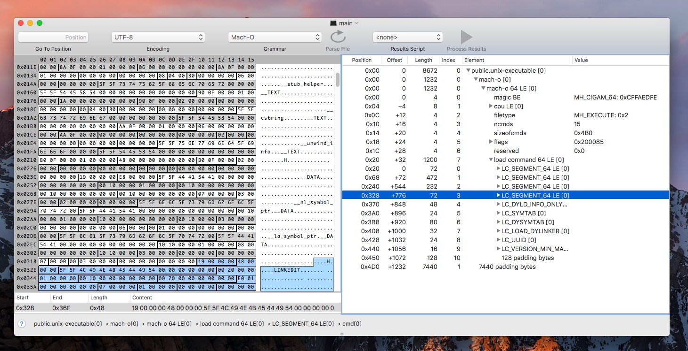

在 `LC_SEGMENT_64` 中有四个元素，分别是 `__PAGEZERO`、`__TEXT`、`__DATA`、`__LINKEDIT` 这四个 Segment。其中，`__TEXT` 的 `__text` Section 的加载是可以验证到的，我们从 Section 的实例中取出其 `addr` 来对比汇编之后代码的起始地址即可。使用 `otool -vt main` 来获取其汇编代码：

```
~ otool -vt main
main:
(__TEXT,__text) section
_main:
0000000100000f60	pushq	%rbp
0000000100000f61	movq	%rsp, %rbp
0000000100000f64	subq	$0x10, %rsp
0000000100000f68	leaq	0x3b(%rip), %rdi
0000000100000f6f	movl	$0x0, -0x4(%rbp)
0000000100000f76	movb	$0x0, %al
0000000100000f78	callq	0x100000f8a
0000000100000f7d	xorl	%ecx, %ecx
0000000100000f7f	movl	%eax, -0x8(%rbp)
0000000100000f82	movl	%ecx, %eax
0000000100000f84	addq	$0x10, %rsp
0000000100000f88	popq	%rbp
0000000100000f89	retq
```

对比 *Synalyze It!* 的分析结果中 `SEG__TEXT.__text` 中的 `addr` 观察：

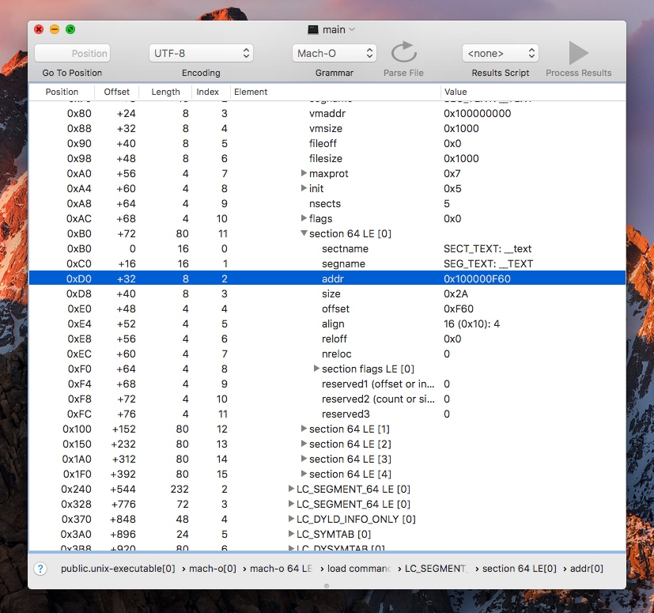


其对应的物理地址均为 `0x100000F60`，说明其 `LC_SEGMENT` 对于 Segment 和 Section 的加载与我们的预期完全一致。

## 对于 `__TEXT.__stubs` 的一些探究

这是对于五子棋大神的 [*深入剖析Macho (1)*](http://satanwoo.github.io/2017/06/13/Macho-1/) 中的过程进行再次验证。在查阅过关于 `__stubs` 的相关资料后还是不太理解到底是个什么东西。在知乎中有这么一个[问题](https://www.zhihu.com/question/24844900)，其中的观点是 Stub 会根据不同的代码上下文表示的含义不同。在 [wikipedia](https://en.wikipedia.org/wiki/Method_stub) 也有一个关于 [Method stub](https://en.wikipedia.org/wiki/Method_stub) 的词条，其中的解释是这样的：

> A method stub or simply stub in software development is a piece of code used to stand in for some other programming functionality. A stub may simulate the behavior of existing code (such as a procedure on a remote machine) or be a temporary substitute for yet-to-be-developed code. Stubs are therefore most useful in porting, distributed computing as well as general software development and testing.

大意就是：*Stub 是指用来替换一部分功能的程序段。桩程序可以用来模拟已有程序的行为（比如一个远端机器的过程）或是对将要开发的代码的一种临时替代。*

我们将 Calculator 应用拖入到 *Synalyze It!* 和 *Hopper Disassembler* 中。首先使用 *Synalyze It!* 来查找一个 `__stubs` 地址：

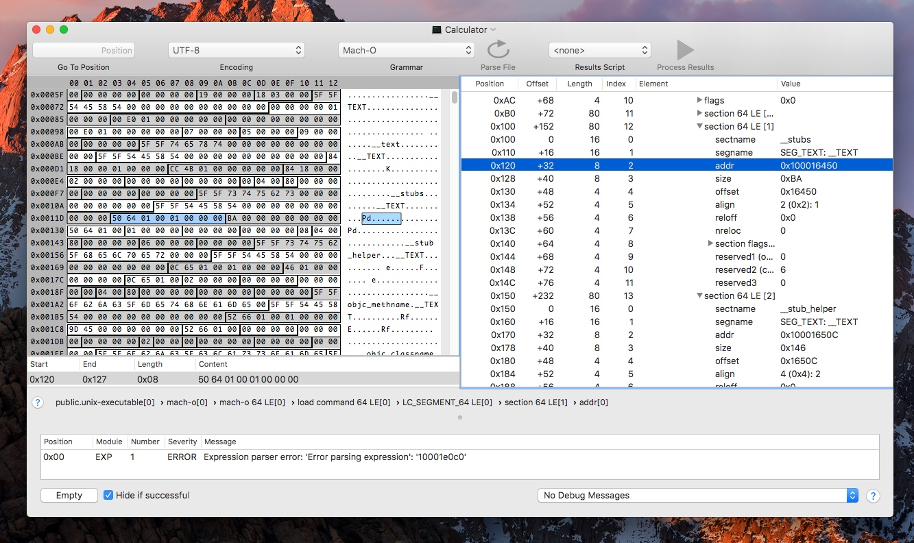

取出地址 `0x100016450` 并在 *Hopper* 中查找对应的代码，并以此双击进入：

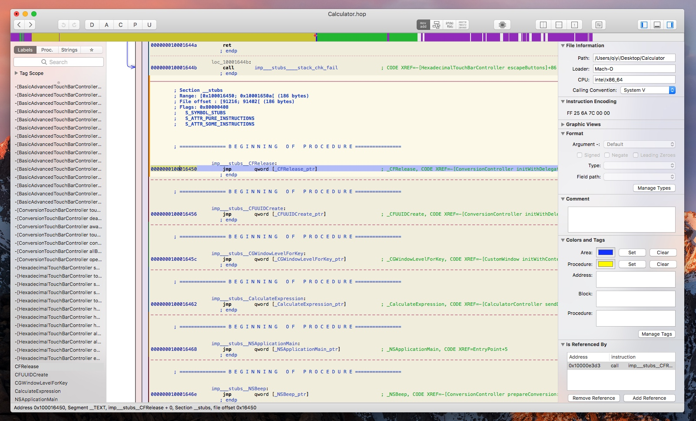

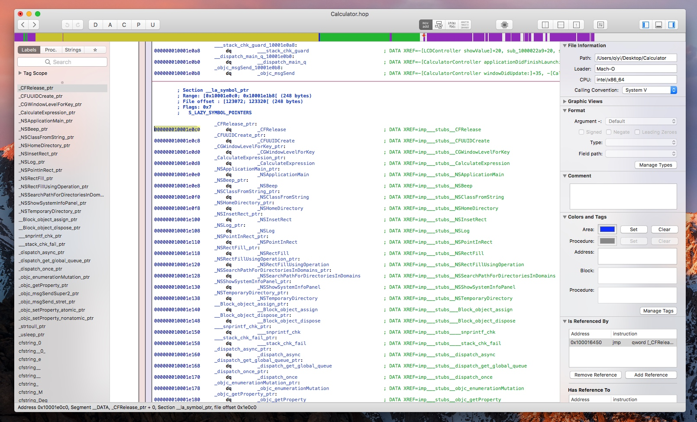

到达第二幅图的位置的时候，我们发现无法继续进入，因为 `_CFRelease` 中的代码是没有意义的。我们拿出 `0x100031000` 这个首地址，在 *MachOView* 中查找：

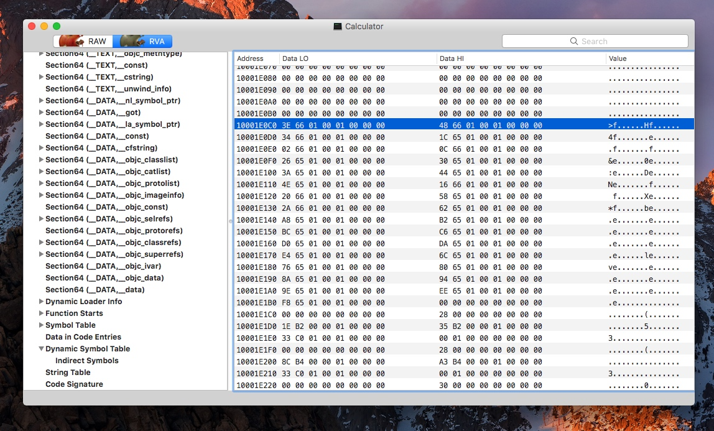

发现其低 32 位的值为 `0x00000010001663E`，将这个地址继续在 *hopper* 中搜索：

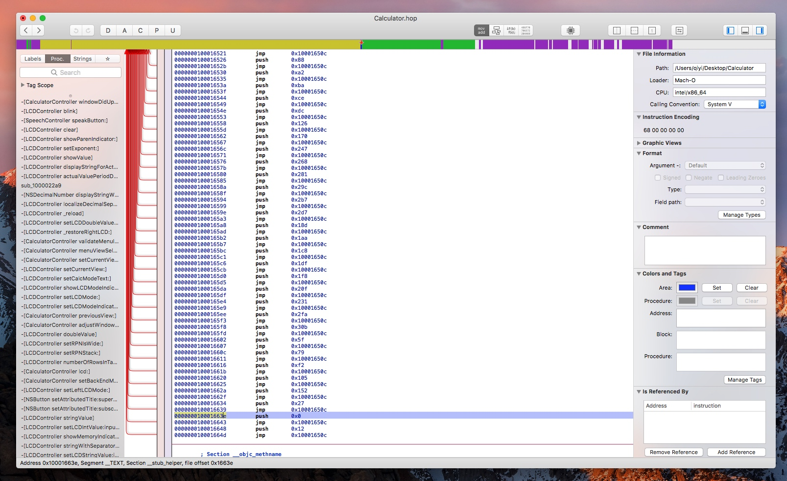

发现这一系列操作都会跳到 `0x000000010001650c` 这个位置，而这里就是 `__TEXT.__stub_helper` 的表头。

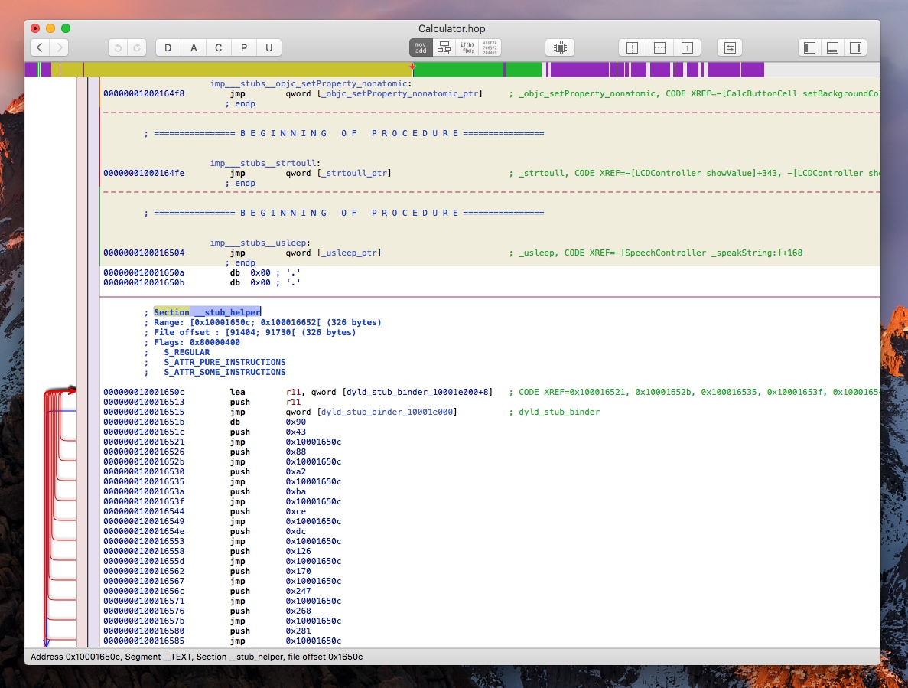


也就是说，`__la_symbol_ptr` 里面的所有表项的数据在开始时都会被 binding 成 `__stub_helper`。而在之后的调用中，虽然依旧会跳到 `__stub` 区域，但是 `__la_symbol_ptr` 中由于在之前的调用中获取到了对应方法的真实地址，所以无需在进入 *dyld_stub_binder* 阶段，并直接调用函数。这样就完成了一次近似于 **lazy** 思想的延时 binding 过程。（这个过程可以用 lldb 来加以验证，在之后会补充。）

总结一下 Stub 机制。其实和 `wikipedia` 上的说法一致，设置函数占位符并采用 **lazy** 思想做成延迟 binding 的流程。在 macOS 中也是如此，外部函数引用在 `__DATA` 段的 `__la_symbol_ptr` 区域先生产一个占位符，当第一个调用启动时，就会进入符号的动态链接过程，一旦找到地址后，就将 `__DATA` Segment 中的 `__la_symbol_ptr` Section 中的占位符修改为方法的真实地址，这样就完成了只需要一个符号绑定的执行过程。

## 参考文献

* [深入剖析MachO - satanwoo 五子棋](http://satanwoo.github.io/2017/06/13/Macho-1/)
* [Mach-O二进制文件解析 - 刘振天](http://blog.tingyun.com/web/article/detail/1341?spm=5176.100239.blogcont64288.7.IuEYnv)
* [由App的启动说起 - Jamin's Blog](http://oncenote.com/2015/06/01/How-App-Launch/)
* [dylib浅析 - leisuro 的村屋](https://makezl.github.io/2016/06/27/dylib/)
* [Mach-O文件格式 - 非虫](https://zhuanlan.zhihu.com/p/24858664)

> 若想查看更多的iOS Source Probe文章，收录在这个[Github仓库中](https://github.com/Desgard/iOS-Source-Probe)。
