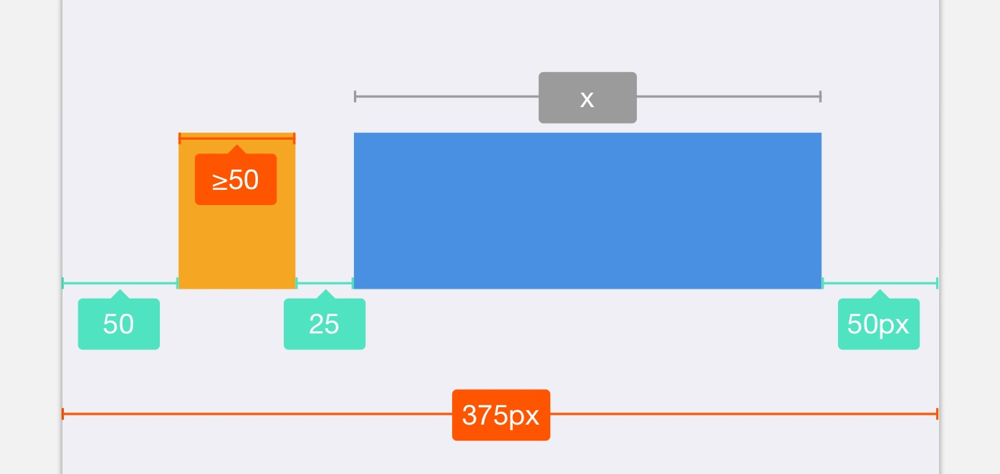
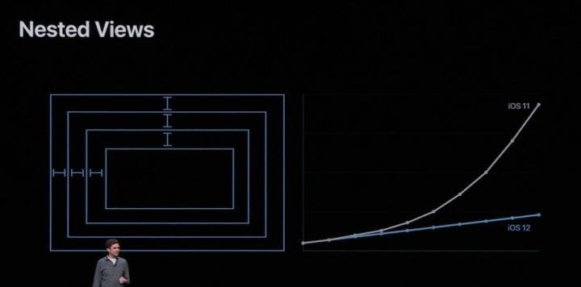

> 作者：冬瓜

> 原文链接：[Guardia · 瓜地](https://www.desgard.com/autolayout-simplex/)

> 代码参考：[iOS-Source-Probe](https://github.com/Desgard/iOS-Source-Probe/tree/linear_arithmetic_constraints)

# AutoLayout 中的线性规划 - Simplex 算法

前一段时间由于跳槽，博客停更了大概有 150 天左右的样子。在所有事情都安置好后，决定推掉之前写过的半截文章，开始更这么一个专题。再这之前，自己没有阅读 paper 的习惯，这也是一次对自己的挑战。

本文与 iOS 关系不大，多半偏向 paper 的学习和算法介绍，请读者根据兴趣自行阅读。

## 温习线性规划

当我们在 Storyboard 上建立完一堆约束后，发现其实所有的约束都可以用多个约束间的不等式关系来描述。于是乎将 UI 的布局问题，就转化成了一个**线性规划问题**。


如何求解这个线性规划问题呢？我们引入一个求解线性规划的经典方法 - **Simplex 算法**。虽然该算法具有指数时间的复杂度，但是在绝大多数情况下仍旧会保持着多项式时间复杂度，关于复杂度分析我们在后文具体分析。

## Simplex 算法

Simplex 算法主要有三个步骤：

1. 找到一个初始的基本可行解；
2. 持续进行*旋转（Pivot）*操作；
3. 重复操作 2，直到找到最优解；

Simplex 算法我以下面一个线性规划方程为例：

$$
\begin{cases}
	\ -x_1-14x_2-6x_3 \quad min\\
	\ x_1+x_2+x_3+x_4=4&\\
	\ x_1\leq2\\
	\ x_3\leq3\\
	\ 3x_2+x_3\leq6\\
	\ x_1,x_2,x_3\geq0
\end{cases}
$$

改写成**松弛形式**：

$$
\begin{cases}
	\ -x_1-14x_2-6x_3 \quad min\\
	\ x_1+x_2+x_3+x_4=4 \\
	\ x_1+x_5=2 \\
	\ x_3+x_6=3 \\
	\ 3x_2+x_3+x_7=6 \\
	\ x_1, x_2, x_3, x_4, x_5, x_6, x_7 \geq 0
\end{cases}
$$

将增加的松弛量放到等号左边，得到**基本变量**和**非基本变量**关系式：

$$
\begin{cases}
	\ \beta=-x_1-14x_2-6x_3 \\
	\ x_4=4-x_1-x_2-x_3 \\
	\ x_5=2-x_1 \\
	\ x_6=3-x_3 \\
	\ x_7=6-3x_2-x_3
\end{cases}
$$

将右边所有非常量都设为 0，然后左边基本变量的值求得：

$$
(x_1,x_2,...,x_7)=(0,0,0,4,2,3,6)
$$

此时目标值 $\beta=0$。求出基本可行解后，我们开始对其做旋转操作。每次旋转，我们选择目标函数中带有负常数项进行放大操作，此时选定 $x_1$。将 $x_1=2-x_5$ 带入非基本变量：

$$
\begin{cases}
	\ \beta=-2-14x_2-6x_3+x_5 \\
	\ x_4=2-x_2-x_3+x_5 \\
	\ x_5 = 2-x_1 \\
	\ x_6 = 3-x_3 \\
	\ x_7 = 6-3x_2-x_3
\end{cases}
$$

每次旋转过程，一次旋转选取一个非基本变量，这里称作**替入变量** $x_e$ 和一个**替出变量** $x_i$，然后带入变量。此时继续将所有非常量为设为 0，得到：

$$
(x_1,x_2,...,x_7)=(2,0,0,2,0,3,6) \\
\beta = -2
$$

此时我们发现目标值减少了 `-2`。继续旋转，这次我们选择 $x_2$，通过式 ② 得到 $x_2=2-x_3-x_4+x_5$ 带入得到：

$$
\begin{cases}
	\ \beta = -30-\frac{2}{3}x_3+x_4+\frac{13}{3}x_7 \\
	\ x_2=2-\frac{1}{3}x_3-\frac{1}{3}x_7 \\
	\ x_1=2-\frac{2}{3}x_3-x_4+\frac{1}{3}x_7 \\
	\ x_6=3-x_3 \\
	\ x_5=\frac{2}{3}x_3+x_4-\frac{1}{3}x_7
\end{cases}
$$

求出解和目标值为：

$$
(x_1,x_2,...,x_7)=(2,2,0,0,0,3,0) \\
\beta=-2
$$

发现其目标值并没有提升，之后我们做最后一次旋转，选择 $x_3$，通过式 ② 得到 $x_3=3-\frac{3}{2}x_1-\frac{3}{2}x_4-\frac{1}{2}x_7$，然后分别带入：

$$
\begin{cases}
	\ \beta = -32+x_1+2x_4+4x_7 \\
	\ x_2=1+\frac{1}{2}x_1+\frac{1}{2}x_4-\frac{1}{2}x_7 \\
	\ x_3=3-\frac{3}{2}x_1-\frac{3}{2}x_4+\frac{1}{2}x_7 \\
	\ x_6=\frac{3}{2}x_1+\frac{3}{2}x_4-\frac{1}{2}x_7 \\
	\ x_5=2-x_1
\end{cases}
$$

现在目标函数中没有可以增大的项了，停止选装。所以 $\beta=-32$ 是我们最终的目标解。此时基本解为 $(x_1,x_2,...,x_7)=(0,1,3,0,2,0,0)$。

可是往往事情并不想这次的计算那么顺利，有的时候我们发现旋转操作一直无法将目标值继续扩大或缩小，也就是之前计算中的倒数第二次选装操作。这种现象叫做**退化（Degeneracy）**。有的时候退化现象还会产生旋转**循环（cycling）**，从而一直无法到最终的旋转状态。产生循环的原因在《算法导论》中有解释：

> Degeneracy can prevent the simplex algorithm from terminating, because it can lead to a phenomenon known as cycling: the slack forms at two different iterations of SIMPLEX are identical. Because of degeneracy, SIMPLEX could choose a sequence of pivot operations that leave the objective value unchanged but repeat a slack form within the sequence. Since SIMPLEX is a deterministic algorithm, if it cycles, then it will cycle through the same series of slack forms forever, never terminating.

简单的来表述，其实是因为 Simplex 算法自身的原因，可能会产生不同的旋转迭代过程中，松弛形式相同，从而无法缩减目标值，并构成循环条件。

避免退化的方法就是使用 **Bland 规则**：在选择带入变量和替出变脸的时候，选择满足下列条件的最小值：

1. 带入变量 $x_e$：目标条件中，系数为负数的第一个作为带入变量；
2. 替出变量 $x_i$：对所有约束条件中，选择对 $x_e$ 约束强度最大的一式；

## Simplex 算法 Coding 及改善

拿出最开始的线性规划方程组（松弛形式）：

$$
\begin{cases}
	\ -x_1-14x_2-6x_3 \quad min\\
	\ x_1+x_2+x_3+x_4=4 \\
	\ x_1+x_5=2 \\
	\ x_3+x_6=3 \\
	\ 3x_2+x_3+x_7=6 \\
	\ x_1, x_2, x_3, x_4, x_5, x_6, x_7 \geq 0
\end{cases}
$$

用三个矩阵来表达这个松弛形式：

$$
C =
\left\{
	\begin{matrix}
		-1 & -14 & -6 & 0 & 0 & 0 & 0 \\
	\end{matrix}
\right\}
$$

$$
B = 
\left\{
	\begin{matrix}
		4 \\
		2 \\
		3 \\
		6 
	\end{matrix}
\right\}
$$

$$
A = 
\left\{
	\begin{matrix}
		1 & 1 & 1 & 1 & 0 & 0 & 0 \\
		1 & 0 & 0 & 0 & 1 & 0 & 0 \\
		0 & 0 & 1 & 0 & 0 & 1 & 0 \\
		0 & 3 & 1 & 0 & 0 & 0 & 1  
	\end{matrix}
\right\}
$$

* 矩阵 A：约束条件的系数矩阵；
* 矩阵 B：约束条件值矩阵；
* 矩阵 C：目标函数系数矩阵；

把这三个矩阵拼接起来：

$$
S_1 = 
\left\{
\begin{matrix}
	0 & -1 & -14 & -6 & 0 & 0 & 0 & 0 \\
	4 & 1 & 1 & 1 & 1 & 0 & 0 & 0 \\
	2 & 1 & 0 & 0 & 0 & 1 & 0 & 0 \\
	3 & 0 & 0 & 1 & 0 & 0 & 1 & 0 \\
	6 & 0 & 3 & 1 & 0 & 0 & 0 & 1  
\end{matrix}
\right\}
$$

然后我们拿出第一次旋转后的约束方程：

$$
\begin{cases}
	\ \beta=-2-14x_2-6x_3+x_5 \\
	\ x_4=2-x_2-x_3+x_5 \\
	\ x_5 = 2-x_1 \\
	\ x_6 = 3-x_3 \\
	\ x_7 = 6-3x_2-x_3
\end{cases}
$$

整理后获得矩阵：

$$
S_2 =
\left\{
\begin{matrix}
	2 & 0 & -14 & -6 & 0 & 1 & 0 & 0 \\
	2 & 0 &  1  & 1 & 1 & -1 & 0 & 0 \\
	2 & 1 & 0 & 0 & 0 & 1 & 0 & 0 \\
	3 & 0 & 0 & 1 & 0 & 0& 1 & 0 \\
	6 & 0 & 3 & 1 & 0 & 0 & 0 & 1 \\
\end{matrix}
\right\}
$$

在这一步中，我们选择了将 $x_1$ 用 $x_5$ 表示。矩阵变换由于 $x_1$ 是被替换量。

第三行中，我们需要的是将选用量的系数归一。所以该行只要进行 `matrix[2] /= matrix[2][1]` 即可。

我们推导一下非第三行的变换规律。$x_1=2-x_5$，得到第 i 行的系数 `matrix[i - 1] = matrix[i - 1] - matrix[2] * matrix[i - 1][1]`。我们发现还原操作最后变成了两行相减。

对于目标函数，与非第三行进行同样的操作即可。通过这个思路写出代码：

```python
import numpy as np


class Simplex(object):

    def __init__(self, obj, max_mode=False):
        # 默认是解决 min LP 问题，如果是最大值用 True，要 mut -1
        self.max_mode = max_mode
        self.mat = np.array([[0] + obj]) * (-1 if max_mode else 1)

    def add_constraint(self, a, b):
        # 增加约束，即在矩阵最后一行增加
        self.mat = np.vstack([self.mat, [b] + a])

    @property
    def solve(self):
        # 获得矩阵的纬度
        m, n = self.mat.shape
        # 零矩阵和对角矩阵上下排列
        temp, B = np.vstack([np.zeros((1, m - 1)), np.eye(m - 1)]), list(range(n - 1, n + m - 1))
        # 组合系数矩阵
        mat = self.mat = np.hstack([self.mat, temp])
        # 循环所有目标函数的系数,直到全部没有负数为止
        while mat[0, 1:].min() < 0:
            # 1. 选择合适的替入和替出变量
            # Bland 规则对矩阵做退化操
            col = np.where(mat[0, 1:] < 0)[0][0] + 1
            row = np.array([mat[i][0] / mat[i][col] if mat[i][col] > 0 else 0x7fffffff for i in
                            range(1, mat.shape[0])]).argmin() + 1  # find the theta index
            # 如果没有替出变量,则说明原问题无界
            if mat[row][col] <= 0: return None

            # 2. 旋转过程
            # 系数归一,整行相除
            mat[row] /= mat[row][col]
            # 对所有 i!= row 进行 mat[i]= mat[i] - mat[row] * mat[i][col] 操作
            ids = np.arange(mat.shape[0]) != row
            mat[ids] -= mat[row] * mat[ids, col:col + 1]
            B[row] = col
        # 返回目标值,若为最小值,则要 * -1,最大值则不用。
        # 后面的矩阵是各个解的系数矩阵,基本变量对应 bi,非基本变量为0
        # B[i] < n 判断即为删除松弛增加的变量
        return mat[0][0] * (1 if self.max_mode else -1), {B[i]: mat[i, 0] for i in range(1, m) if B[i] < n}


if __name__ == '__main__':
    t = Simplex([-1, -14, -6])
    t.add_constraint([1, 1, 1], 4)
    t.add_constraint([1, 0, 0], 2)
    t.add_constraint([0, 0, 1], 3)
    t.add_constraint([0, 3, 1], 6)
    print(t.solve)
    print(t.mat)

'''
(-32.0, {2: 1.0, 3: 3.0})
[[32.   1.   0.   0.   2.   0.   0.   4. ]
 [ 1.  -0.5  1.   0.  -0.5  0.   0.   0.5]
 [ 3.   1.5  0.   1.   1.5  0.   0.  -0.5]
 [ 0.  -1.5  0.   0.  -1.5  0.   1.   0.5]
 [ 2.   1.   0.   0.   0.   1.   0.   0. ]]
'''
```

## 算法再修正

给出这么一个测试用例：

$$
\begin{cases}
	\ x_1+2x_2 \quad min\\
	\ x_1+x_2\leq2\\
	\ x_1+x_2\geq1\\
	\ x_1,x_2\geq0
\end{cases}
$$

使用上述算法带入：

```python
if __name__ == '__main__':
    t = Simplex([1, 2])
    t.add_constraint([1, 1], 2)
    t.add_constraint([1, 1], 1)
    print(t.solve)
    print(t.mat)
    
'''
(-0.0, {})
[[0. 1. 2. 0. 0.]
 [2. 1. 1. 1. 0.]
 [1. 1. 1. 0. 1.]]
'''
```

由于 `c >= 0` 造成 `solve` 方法直接不迭代。我们用 GLPK 来求解一下该问题：

```glpsol
var x1 >= 0;
var x2 >= 0;

minimize obj: x1 + 2 * x2;

c1: x1 + x2 <= 2;
c2: x1 + x2 >= 1;

solve;
display x1;
display x2;
end;
```

```bash
A: min|aij| =  1.000e+00  max|aij| =  1.000e+00  ratio =  1.000e+00
Problem data seem to be well scaled
Constructing initial basis...
Size of triangular part is 2
      0: obj =   0.000000000e+00 inf =   1.000e+00 (1)
      1: obj =   1.000000000e+00 inf =   0.000e+00 (0)
OPTIMAL LP SOLUTION FOUND
Time used:   0.0 secs
Memory used: 0.1 Mb (102205 bytes)
Display statement at line 10
x1.val = 1
Display statement at line 11
x2.val = 0
Model has been successfully processed
```

得出目标值为 `1`，解集 $(x_1, x_2)=(1, 0)$。答案是明显不一致的。

追溯一下原因。在之前的做法中，在第一步我们将所有的待求量设为 0 从而获得了初始解作为第一次旋转的基本可行解。这个步骤是否可行能？同样的我们带入到其松弛形式，发现 $x_3=-2$ 是不满足条件的，所以初始解是不能作为第一组基本可行解。

所以如果存在 $b_i<0$ 的情况，就需要重新进行初始化操作，并返回一个基本可行解。我们引入构造**辅助线性规划（Auxiliary Linary program）**。具体的辅助线性规划其实就是引入一个$x_0$，对其进行最大化操作以测试用例为例：


$$
\begin{cases}
	\ x_0 \quad min\\
	\ x_1+x_2-x_0 &\leq2\\
	\ -x_1-x_2-x_0 &\leq-1\\
	\ x_1,x_2,x_0 &\geq0
\end{cases}
$$

转换成松弛形式：

$$
\begin{cases}
	& z = x_0 \\ 
	&x_3 = 2 – x_1 – x_2 + x_0 \\ 
	&x_4 = -1 + x_1 + x_2 + x_0\\ 
	&x_1, \quad x_2,\quad x_3,\quad x_4,\quad x_0 &\geq{0} &\\ 
\end{cases}
$$

这时我们可以发现我们可以将引入的 $x_0$ 当做替入变量做一次旋转，得到新式。进而通过再次旋转分别求出最终解。

$$
\begin{alignat}{2} 
&z = 1 – x_1 – x_2 + x_4\\ 
&x_3 = 2 – x_1 – x_2 + x_0 \\ 
&x_0 = 1 – x_1 – x_2 + x_4\\ 
\end{alignat}
$$

我们总结一下这个流程：

1. 若 $b_i$ 都为非负数。则直接使用原来的 *Simplex* 方法进行求解；
2. 否则引入 $x_0$，创建辅助线性规划 $L_aux$；
3. 松弛形式，选择 $b_i$ 最小项的那行带入，$x_0$ 作为替入变量进行一次旋转；
4. 求解 $L_aux$，若最优解为 0，说明有解。否则直接退出；
5. $x_0$ 为基本解，继续旋转，使其成为非基本变量；
6. 恢复原始目标函数，替换变量；
7. 使用原来的 *Simplex* 求解；

```python
class Simplex(object):

    def __init__(self, obj, max_mode=False):
        # 默认是解决 min LP 问题，如果是最大值用 True，要 mut -1
        self.mat, self.max_mode = np.array([[0] + obj]) * (-1 if max_mode else 1), max_mode

    # 增加约束
    def add_constraint(self, a, b):
        # 增加约束，即在矩阵最后一行增加
        self.mat = np.vstack([self.mat, [b] + a])

    # Simplex 算法过程
    def _simplex(self, mat, B, m, n):
        while mat[0, 1:].min() < 0:
            # Bland 规则对矩阵做退化操
            col = np.where(mat[0, 1:] < 0)[0][0] + 1
            row = np.array([mat[i][0] / mat[i][col] if mat[i][col] > 0 else 0x7fffffff for i in
                            range(1, mat.shape[0])]).argmin() + 1
            # 如果没有替出变量,则说明原问题无界
            if mat[row][col] <= 0: return None  # the theta is ∞, the problem is unbounded
            self._pivot(mat, B, row, col)
        # 返回目标值,若为最小值,则要 * -1,最大值则不用。
        # 后面的矩阵是各个解的系数矩阵,基本变量对应 bi,非基本变量为0
        # B[i] < n 判断即为删除松弛增加的变量
        return mat[0][0] * (1 if self.max_mode else -1), {B[i]: mat[i, 0] for i in range(1, m) if B[i] < n}

    # 旋转过程
    def _pivot(self, mat, B, row, col):
        # 对所有 i!= row 进行 mat[i]= mat[i] - mat[row] * mat[i][col] 操作
        mat[row] /= mat[row][col]
        ids = np.arange(mat.shape[0]) != row
        mat[ids] -= mat[row] * mat[ids, col:col + 1]
        B[row] = col

    def solve(self):
        # 获得矩阵的纬度
        m, n = self.mat.shape
        # 组合系数矩阵
        temp, B = np.vstack([np.zeros((1, m - 1)), np.eye(m - 1)]), list(range(n - 1, n + m - 1))
        # 循环所有目标函数的系数,直到全部没有负数为止
        mat = self.mat = np.hstack([self.mat, temp])  # combine them!
        # 判断最小的常数 b 是否存在小于 0 的情况,有的话则初始解不可行
        if mat[1:, 0].min() < 0:
            # 找到最小 b 的那一列
            row = mat[1:, 0].argmin() + 1
            # temp 保存原先的目标函数, 第0行设置为0
            temp, mat[0] = np.copy(mat[0]), 0
            # 添加 x0 需要拼接的矩阵,构造辅助线性规划
            mat = np.hstack([mat, np.array([1] + [-1] * (m - 1)).reshape((-1, 1))])
            # 执行一次旋转操作,将系数b最小的那一项替出
            self._pivot(mat, B, row, mat.shape[1] - 1)
            # 求解辅助线性规划,如果最优值为0,则有解,否则无解
            if self._simplex(mat, B, m, n)[0] != 0: return None

            # 若x0是基本解,需要将 x0 替出
            if mat.shape[1] - 1 in B:
                # 增加一次旋转来替出 x0
                self._pivot(mat, B, B.index(mat.shape[1] - 1), np.where(mat[0, 1:] != 0)[0][0] + 1)

            # 恢复目标函数
            self.mat = np.vstack([temp, mat[1:, :-1]]) 
            for i, x in enumerate(B[1:]):
                self.mat[0] -= self.mat[0, x] * self.mat[i + 1]
        return self._simplex(self.mat, B, m, n)
```

## 一个简单的场景



图中是两个 `UIView` 红色和绿色是我们已经设置好的 AutoLayout 约束。我们根据约束条件，得到下列线性规划方程：

$$
\begin{cases}
	\ 50+x_1+25+x_2+50\leq375 \\
	\ x_1\geq50
\end{cases}
$$

根据线性规划整理一下方程：

$$
\begin{cases}
    \ x_2 \quad max \\
    \ x_1+x_2&\leq250 \\
    \ -x_1&\leq-50
\end{cases}
$$

使用我们的 Simplex 算法按照要求带入求得 $x=200$:

```python
t = Simplex([0, 1], max_mode=True)
t.add_constraint([1, 1], 250)
t.add_constraint([-1, 0], -50)
print(t.solve())
print(t.mat)

'''
(200.0, {2: 200.0, 1: 50.0})
[[200.   0.   0.   1.   1.]
 [200.   0.   1.   1.   1.]
 [ 50.   1.   0.   0.  -1.]]
'''
```

## 复杂度分析

Simplex 算法再单次约束计算中是否十分高效呢，我们来讨论一下其复杂度。

若对于一个 $m\times n$ 的矩阵来说，我们所有的时间开销均再以下三个点:

1. 每次需要查找在目标方程中的一个负数 `O(n)`；
2. 每次需要查找对应项方程 `O(m)`；
3. 旋转操作中，每次需要执行 `mat[i] = mat[i] - mat[row] * mat[i][col]`。这个操作是对整个行进行操作，并且是按列下标遍历。`np.arrange` 操作每次会将行列扩展，我们将行定义为最大阈值 `m+n`，所以旋转开销 `O(m*(m+n)) = O(mN)`；

当然这只是一次 *Simplex* 算法索要执行的时间开销。假设需要运行 `k` 次，则一次 *Simplex* 的时间复杂度为 `O(kmN)`。

## 总结

这里我们不得不说 WWDC 2018 - 202 中对于 AutoLayout 复杂度的图示：



虽然 *Simplex* 无论从我们上方的推导 `O(kmN)` 还是论文 *[Smoothed Analysis of Algorithms: Why the Simplex Algorithm Usually Takes Polynomial Time](http://www.di.ens.fr/~vergnaud/algo0910/Simplex.pdf)* 里的论证，关于线性规划问题都会是一个**多项式时间**的复杂度。但是到目前为止，我们没有讨论任何增加一个新的约束之后与之前线性复杂度的开销对比。但是从直观计算上来讲，多了一个约束意味着纬度 `m` 和 `n` 均可能增大。那么说明当前场景下真实的**多项式复杂度增量次幂并不为 1**。那么，Apple 此次的优化是否是一次突破性的提升，还是修复了阿三之前的 Bug，还不能给出确定的结论。

这次的 *Simplex* 算法对于线性规划问题的 AutoLayout 问题只是最原始的算法基础。线性约束算法还有很多值得探究的算法，例如 *Cassowary*、*QOCA* 等等。后续将会做进一步的分析和学习。
 
 
## Reference

* [Smoothed Analysis of Algorithms: Why the Simplex Algorithm Usually Takes Polynomial Time](http://www.di.ens.fr/~vergnaud/algo0910/Simplex.pdf)
* [CS711008Z Algorithm Design and Analysis Lecture 8. Algorithm design technique: Linear programming](http://bioinfo.ict.ac.cn/~dbu/AlgorithmCourses/Lectures/Lec8.pdf)
* [https://constraints.cs.washington.edu/solvers/uist97.pdf](Solving Linear Arithmetic Constraints for User Interface Applications)

