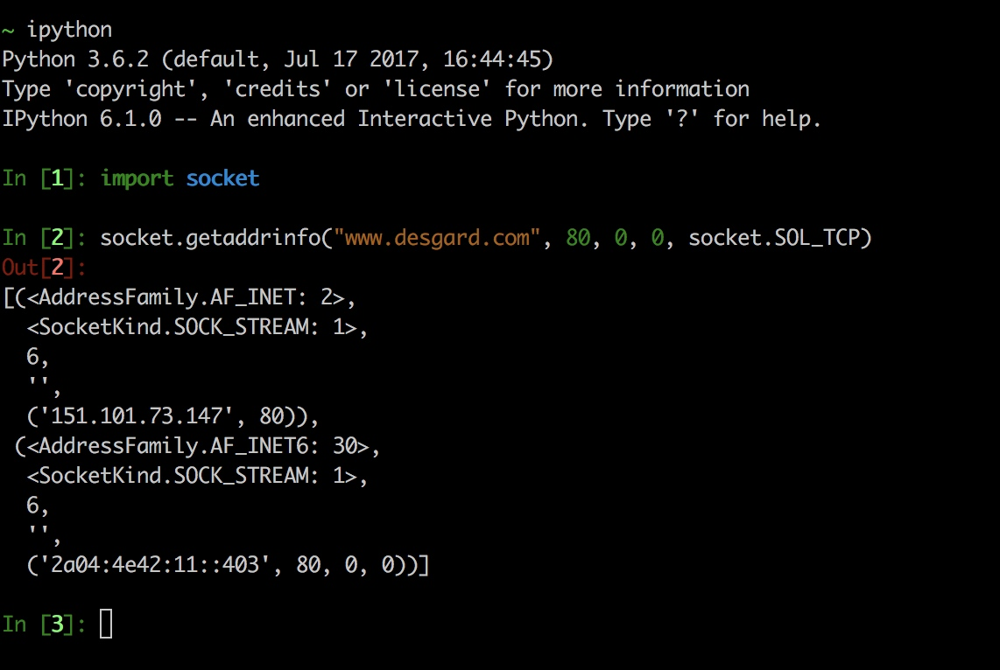
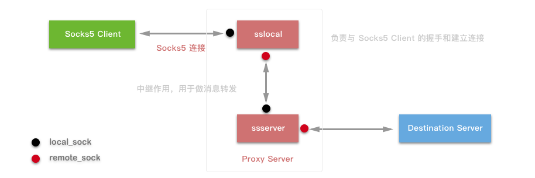
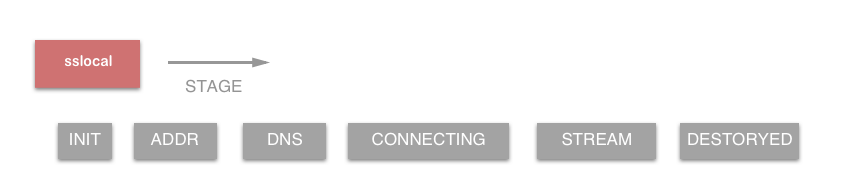
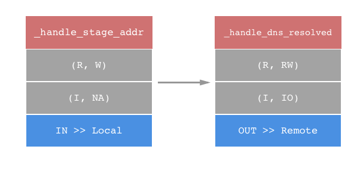
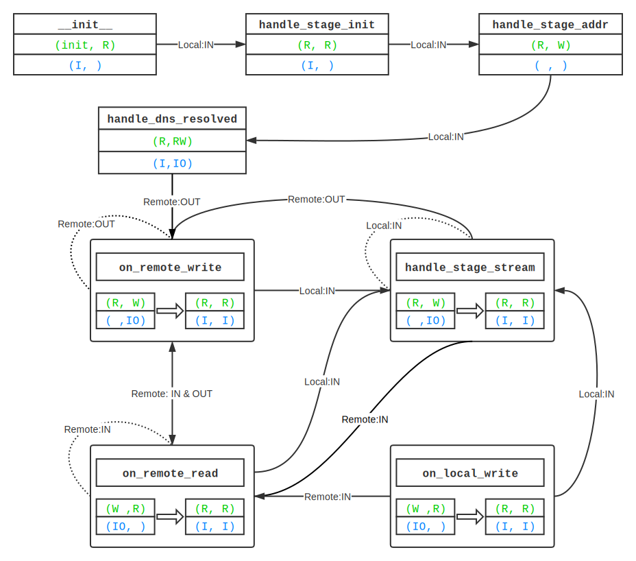

> 作者：冬瓜

> 原文链接：[Guardia · 瓜地](http://www.desgard.com/Shadowsocks-2/)

# Shadowsocks Probe II - TCP 代理过程

>（续 [Shadowsocks Probe I - Socks5 与 EventLoop 事件分发](https://github.com/Desgard/iOS-Source-Probe/blob/master/Python/Shadowsocks/Shadowsocks%20Probe%20I%20-%20Socks5%20%E4%B8%8E%20EventLoop%20%E4%BA%8B%E4%BB%B6%E5%88%86%E5%8F%91.md)）

## TCPRelay 及 Socket 监听事件

前文我们了解了 Shadowsocks 通过 `EventLoop` 的循环，整体构建了一个 `Reactor` 模式来将时间逐层传递给 `EventHandler`，然后在进行 I/O 处理。

我们再次查看 `handle_event` 的代码进行跟踪：

```python
def handle_event(self, sock, fd, event):
   # 处理 events 并派发到指定的 handlers
   if sock:
       logging.log(shell.VERBOSE_LEVEL, 'fd %d %s', fd,
                   eventloop.EVENT_NAMES.get(event, event))
   # 如果是 TCPRelay 的 socket
   # 这时候说明有 TCP 连接,创建 TCPRelayHandler 并封装
   if sock == self._server_socket:
       if event & eventloop.POLL_ERR:
           # TODO
           raise Exception('server_socket error')
       try:
           logging.debug('accept')
           # 接受连接
           conn = self._server_socket.accept()
           # 完成 handler 封装
           TCPRelayHandler(self, self._fd_to_handlers,
                           self._eventloop, conn[0], self._config,
                           self._dns_resolver, self._is_local)
       except (OSError, IOError) as e:
           error_no = eventloop.errno_from_exception(e)
           if error_no in (errno.EAGAIN, errno.EINPROGRESS,
                           errno.EWOULDBLOCK):
               return
           else:
               shell.print_exception(e)
               if self._config['verbose']:
                   traceback.print_exc()
   else:
       if sock:
           # 找到 fd 对应的 TCPRelayHandler
           handler = self._fd_to_handlers.get(fd, None)
           if handler:
               # 启用 handler 来处理读写事件
               handler.handle_event(sock, event)
       else:
           logging.warn('poll removed fd')
```

其实在源码中，作者对客户端链接建立的完全过程做了注释：

```python
# for each opening port, we have a TCP Relay
# 对于每一个开启的端口，都会拥有一个 TCPRelay

# for each connection, we have a TCP Relay Handler to handle the connection
# 对于每一个连接请求，都有一个 TCPRelayHandler 来持有

# for each handler, we have 2 sockets:
#    local:   connected to the client
#    remote:  connected to remote server
# 对于每一个 handler，有两种 Sockets
#     local: 用于链接到客户端
# 	  remote: 用于链接到远程服务器
```

这里解释了每个对象的作用。其中，`TCPRelay` 由 `_server_socket` 来记录监听端口的 Socket，`_listen_port` 和 `_listen_addr` 分别代表监听的端口和地址。另外还有很多属性来记录各种状态，例如 `_config` 来记录配置，`_is_local` 记录是否为本地客户端请求，`_fd_to_handler` 持有对应的 handler 的映射关系。

如果产生 Event 的 Socket 是 `TCPRelay` 本身，那么 `accept()` 之后会建立一个新的 TCP 连接，并创建 `TCPRelayHandler` 对象来负责处理，这种事件用于 Client 端和 Proxy 端的连接和传递；否则说明 Event 的 Socket 为 `TCPRelayHandler` 的，这时候 `fd` 会检索到相关 `handler` 并调用 `handle_event` 来处理 Event。

在继续阅读之前，我们先来回顾 Event 在 `epoll` 的操作过程中可能出现的一些状态，以 C 代码中的宏名称为标准：

```c
EPOLLIN ：表示对应的文件描述符可以读（包括对端SOCKET正常关闭）；
EPOLLOUT：表示对应的文件描述符可以写；
EPOLLPRI：表示对应的文件描述符有紧急的数据可读（这里应该表示有带外数据到来）；
EPOLLERR：表示对应的文件描述符发生错误；
EPOLLHUP：表示对应的文件描述符被挂断；
EPOLLET： 将EPOLL设为边缘触发(Edge Triggered)模式，这是相对于水平触发(Level Triggered)来说的。
EPOLLONESHOT：只监听一次事件，当监听完这次事件之后，如果还需要继续监听这个socket的话，需要再次把这个socket加入到EPOLL队列里
```

在 `eventloop.py` 中我们找到了这些对应状态：

```python
POLL_NULL = 0x00
POLL_IN = 0x01
POLL_OUT = 0x04
POLL_ERR = 0x08
POLL_HUP = 0x10
POLL_NVAL = 0x20

EVENT_NAMES = {
    POLL_NULL: 'POLL_NULL', 	# 事件为空
    POLL_IN: 'POLL_IN',		    # 有数据可读
    POLL_OUT: 'POLL_OUT',		# 写数据不会导致阻塞
    POLL_ERR: 'POLL_ERR',		# 指定的文件描述符发生错误（revents 域）
    POLL_HUP: 'POLL_HUP',		# 指定的文件描述符挂起事件
    POLL_NVAL: 'POLL_NVAL',	    # 指定的文件描述符非法
}
```

而 `TCPRelay` 在循环中拿到的拿到的 Event 只有状态为 `POLL_IN` 才能为其分配指定的 `handle`。而在分配之前，前面的那个代码片段仅仅是判断了 `POLL_ERR` 这种 `fd` 发生错误的状况。于是去查看一下 Event 投放的入口 `add_to_loop` 方法：

```python 
def add_to_loop(self, loop):
    if self._eventloop:
        raise Exception('already add to loop')
    if self._closed:
        raise Exception('already closed')
    self._eventloop = loop
    # 仅仅向 loop 中投递两种状态的 event
    self._eventloop.add(self._server_socket,
                        eventloop.POLL_IN | eventloop.POLL_ERR, self)
    # 为循环增加周期
    self._eventloop.add_periodic(self.handle_periodic)
```

在 `add_to_loop` 中仅注册了可读事件，所以不会出现其他的情况。

在前文中，我们说一个 `TCPRelay` 代表的其实就是一个普通的 TCP 服务器，其中持有了所监听的端口(`_listen_port`)和 IP 地址(`_listen_addr`)。但是我们在使用 Shadowsocks 时，在 PAC 过滤文件中仅仅用域名字符串数组的形式来存储，并无法得知其 IP，那我们的 `TCPRelay` 如何对事件对指定的地址进行转发呢？我们可以在 `__init__` 构造方法的代码中发现答案：

```python
addrs = socket.getaddrinfo(listen_addr, listen_port, 0,
                           socket.SOCK_STREAM, socket.SOL_TCP)
af, socktype, proto, canonname, sa = addrs[0]
server_socket = socket.socket(af, socktype, proto)
server_socket.setsockopt(socket.SOL_SOCKET, socket.SO_REUSEADDR, 1)
server_socket.bind(sa)
```

不禁要问 `getaddrinfo` 方法是什么，问什么能拿到这么多信息？我们用 `iPython` 直接调试一下这个方法：



可以发现 `getaddrinfo` 可以对域名做地址解析。并且通过[文档](http://python.usyiyi.cn/translate/python_278/library/socket.html#socket.getaddrinfo)查询该方法会将**主机参数转换为包含用于创建连接到该服务的 Socket 的所有必须参数的 5 元祖集合**。其函数范式如下：

```python
socket.getaddrinfo(host, port[, family[, socktype[, proto[, flags]]]])

> return (family, socktype, proto, canonname, sockaddr)
```

由此可以看出，这个方法可以获取到主机的全部信息，是 `TCPRelay` 成功监听的关键之一。


## TCPRelayHandler

将 `TCPRelay` 转发给 `TCPRelayHandler` 之后，`handle_event` 会对应选择处理的事件。它会再进一步，根据事件的种类，调用相应的函数来做处理，这也是一个转发的过程。注意，这里的 `handle_event` 是由 `TCPRelayHandler` 实例的方法属性，而不是上文中出现的 `TCPRelay` 中的属性。在这个方法中，会追踪 Socket 来决策调用方法。

在看源码之前，我们先来了解一下 `stage` 过程是如何定义的（还是在 `tcprelay.py` 中）：

```python
# as ssserver:
# stage 0 初始状态，SOCKS5 握手，仅仅需要跳入 STAGE_ADDR 状态即可
# stage 1 SOCKS5 建立连接阶段，从本地获取地址（addr），DNS 进行解析
# stage 3 DNS 解析后连接到远端
# stage 4 从本地获取数据，保持连接
# stage 5 建立管道（pipe），SOCK5 传输

STAGE_INIT = 0
STAGE_ADDR = 1
STAGE_UDP_ASSOC = 2
STAGE_DNS = 3
STAGE_CONNECTING = 4
STAGE_STREAM = 5
STAGE_DESTROYED = -1
```

了解了各个 `stage` 过程的定义，我们来看下 `handle_event` 是如何根据 `stage` 过程种类来调用相应的函数的。这个过程也就是我们了解的**转发过程**：

```python
def handle_event(self, sock, event):
    # 处理所有事件并派发给指定的方法
    if self._stage == STAGE_DESTROYED:
        logging.debug('ignore handle_event: destroyed')
        return
    # 处理顺序很重要，优先级相关
    # 处理 self._romte_sock Socket 
    if sock == self._remote_sock:
        # 文件描述符错误，直接进入 STAGE_DESTROYED 阶段
        if event & eventloop.POLL_ERR:
            self._on_remote_error()
            if self._stage == STAGE_DESTROYED:
                return
        # 有数据可读或已经被挂起，进行读数据事件
        if event & (eventloop.POLL_IN | eventloop.POLL_HUP):
            self._on_remote_read()
            # 如果已经进入 STAGE_DESTROYED 结束处理
            if self._stage == STAGE_DESTROYED:
                return
        # 如果需要写数据，进行写数据事件
        if event & eventloop.POLL_OUT:
            self._on_remote_write()
    # 处理 self._local_sock Socket
    elif sock == self._local_sock:
        if event & eventloop.POLL_ERR:
            self._on_local_error()
            if self._stage == STAGE_DESTROYED:
                return
        if event & (eventloop.POLL_IN | eventloop.POLL_HUP):
            self._on_local_read()
            if self._stage == STAGE_DESTROYED:
                return
        if event & eventloop.POLL_OUT:
            self._on_local_write()
    else:
        # 未知套接字直接打印 log
        logging.warn('unknown socket')
```

以上代码中，`handle_event` 会根据事件发生的 Socket 决定调用方法，我们发现 `self._remote_sock` 和 `self._local_sock` 两个套接字，其执行方法是对称的。这两个套接字的作用分别是什么作用呢？用一张图来描述一下整个的约定：



这是上一篇文章中一张插图的修改，其中黑色圆点代表 `local_sock`，红色圆点代表 `remote_sock`。由于 Shadowsocks 源码是客户端和服务端复用的代码，所以对于 `sslocal` 和 `ssserver` 而言其 Socket 表示的含义不同：

* `sslocal` 而言：`local_sock` 指的是 SOCK5 客户端，`remote_sock` 指的是 `ssserver`；
* `ssserver` 而言：`local_sock` 指的是 `sslocal`，`remote_sock` 指的是目标服务器。

我们可以按照图示位置（想对与当前节点而言），将设备分为左端和右端。抽象出来 `local_sock` 是与左端设备通信的 Socket，而 `remote_sock` 是与右端设备通信的 Socket。这样我们就能发现其对称性，公用一套相同逻辑的代码。

## 事件投递细节

之前提及到的 `handle_event` 方法，当与左端通信的时候，会涉及到三个方法，并对应如下几种事件来定制处理，详细来看一下：

* `POLL_ERR`：`self._on_local_error()` 错误处理。
* `POLL_IN` 或 `POLL_HUP`：`self._on_local_read()` 读事件。
* `POLL_OUT`：`self._on_local_write()` 写事件。

### `_on_local_read` 方法

```python
def _on_local_read(self):
    # 处理所有的本地读事件并派发给不同 stage 处理方法
    # 判断非 sslocal 状态，预防判断
    if not self._local_sock:
        return
    is_local = self._is_local
    data = None
    # 如果是 sslocal 则用上端极值
    if is_local:
        buf_size = UP_STREAM_BUF_SIZE
    else:
        buf_size = DOWN_STREAM_BUF_SIZE
    # 接受至多 buf_size 大小的数据
    try:
        data = self._local_sock.recv(buf_size)
    # 异常处理，分成两种情况
    #   1. 如果异常原因为 ETIMEOUT, EAGAIN, EWOULDBLOCK 直接 return
    #   2. 否则直接销毁当前的 TCPRelayHandler
    except (OSError, IOError) as e:
        if eventloop.errno_from_exception(e) in \
                (errno.ETIMEDOUT, errno.EAGAIN, errno.EWOULDBLOCK):
            return
    if not data:
        self.destroy()
        return
    # 计时器重置
    self._update_activity(len(data))

    # 如果 data 是 sslocal 发送来的，直接解密数据
    if not is_local:
        data = self._cryptor.decrypt(data)
        # 判断数据解析后是否合法
        if not data:
            return

    # 多状态分类讨论，即状态机分类
    if self._stage == STAGE_STREAM:
        self._handle_stage_stream(data)
        return
    elif is_local and self._stage == STAGE_INIT:
        # jump over socks5 init
        if self._is_tunnel:
            self._handle_stage_addr(data)
            return
        else:
            self._handle_stage_init(data)
    elif self._stage == STAGE_CONNECTING:
        self._handle_stage_connecting(data)
    elif (is_local and self._stage == STAGE_ADDR) or \
            (not is_local and self._stage == STAGE_INIT):
        self._handle_stage_addr(data)
```

该方法从 `local_sock` 中读取数据，并通过状态来派发给不同的方法进行处理。在 `_on_local_read` 的实现中可以看出状态机做出了以下方法映射：

* `STAGE_INIT`：`self._handle_stage_init`
* `STAGE_ADDR`：`self._handle_stage_addr`
* `STAGE_CONNECTING`：`self._handle_stage_connecting`
* `STAGE_STREAM`：`self_handle_stage_stream`

而其他的状态仅仅代表一个中间过程量标记，而不导致任何实质性的改变。当然这些状态对于 `TCPRelayHandler` 的状态划分是十分重要的。既然我们已经确定 `TCPRelayHandler` 是一个状态机，那么我们将 `sslocal` 和 `ssserver` 的状态转移列举出来，从而更清晰的把握整体行为驱动：


而 `ssserver` 的状态流程在上述代码中也能找到一些差异：

```python
elif (is_local and self._stage == STAGE_ADDR) or \
       (not is_local and self._stage == STAGE_INIT):
   self._handle_stage_addr(data)
```

`not is_local` 对应的是从 `sslocal` 发送来的数据，所以 `ssserver` 真正的起始状态是 `STAGE_ADDR`，这也验证了上一篇文的一个观点：**`ssserver` 只起到中继作用，负责解密以后将数据转发给目标服务器，并不涉及 SOCK5 协议中任何一部分**。而在 `STAGE_INIT` 阶段主要的工作是**SOCKS5 握手**，所以 `ssserver` 没有这个流程也是理所当然的。

### `_on_local_error` 方法

```python
# 嗅探到是错误，写日志直接销毁
def _on_local_error(self):
    logging.debug('got local error')
    if self._local_sock:
        logging.error(eventloop.get_sock_error(self._local_sock))
    self.destroy()
```

### `_on_local_write` 方法

```python
def _on_local_write(self):
    # 处理本地可写事件
    if self._data_to_write_to_local:
        data = b''.join(self._data_to_write_to_local)
        self._data_to_write_to_local = []
        # 数据写入
        self._write_to_sock(data, self._local_sock)
    else:
        # 更新 Socket 监听事件
        self._update_stream(STREAM_DOWN, WAIT_STATUS_READING)
```

`_on_local_write` 的作用就是如果 `self._data_to_write_to_local` 中有数据，则完成写入 `self._local_sock`，否则更新 Socket 的细节。


## 事件处理细节（Handle）

在上述的分析中，我们已经知道了 `TCPRelayHandler` 在接受事件中，除了根据事件种类进行分类投递以外，还需要区分此时状态机的状态，才能确定处理细节。`_handle_stage_[stage detail]` 方法负责了 SOCKS5 协议的相关通信，控制了 Shadowsocks 内部状态机的转移，是真个项目中的核心部分。

### `_handle_stage_init`

```python
def _handle_stage_init(self, data):
    try:
        # 进行协商授权
        self._check_auth_method(data)
    except BadSocksHeader:
        # 如果是 SOCKS5 协议头错误，授权失败
        self.destroy()
        return
    except NoAcceptableMethods:
        # 验证错误，授权失败
        self._write_to_sock(b'\x05\xff', self._local_sock)
        self.destroy()
        return

    # 写入 sock，代表握手成功
    self._write_to_sock(b'\x05\00', self._local_sock)
    # 状态转移
    self._stage = STAGE_ADDR
```

`_handle_stage_init` 是 SOCKS5 认证方式的协商方法，其中通过 `_check_auth_method` 方法来检测协商授权。需要注意的是，由于整个 SOCKS5 握手过程都是在 `sslocal` 中完成的，所以这个方法只有可能被 `sslocal` 调用。

### `_handle_stage_addr`

这个方法较为繁琐，因为在 `STAGE_ADDR` 过程中要分为 *TCP*、*UDP* 两种方式分别处理，而且还要判断是否开启 *One Time Auth*（一次性授权） 功能。我们将 UDP 和 *One Time Auth* 的代码删去，单看 *TCP* 流程。

```python
def _handle_stage_addr(self, data):
    if self._is_local:
        # 此处获取 CMD 字段，并进行检测
        cmd = common.ord(data[1])
        if cmd == CMD_UDP_ASSOCIATE:
            self._stage = STAGE_UDP_ASSOC
            return
        elif cmd == CMD_CONNECT:
            # 此处使用集合切片
            # 只截取 VER CMD RSV
            data = data[3:]
        else:
            logging.error('unknown command %d', cmd)
            self.destroy()
            return

    # 对切片数据进行解析，并保存在 header_result
    header_result = parse_header(data)
    if header_result is None:
        raise Exception('can not parse header')

    # 这里可以看出 header_result 如果合法，即为一个 4 元元祖
    # addrtype = ATYP
    # remote_addr = DST.ADDR
    # remote_port = DST.PORT
    # header_length = 1 + n + 2
    addrtype, remote_addr, remote_port, header_length = header_result
    # 用 unicode 进行解码
    self._remote_address = (common.to_str(remote_addr), remote_port)
    # 暂停读操作
    self._update_stream(STREAM_UP, WAIT_STATUS_WRITING)
    # 状态转移至 STAGE_DNS
    self._stage = STAGE_DNS

    if self._is_local:
        # 转发 SOCKS5 响应，完成简历连接过程
        self._write_to_sock((b'\x05\x00\x00\x01'
                             b'\x00\x00\x00\x00\x10\x10'),
                            self._local_sock)
        # 在数据存储在 Buffer 之前，进行加密（因为要发送到 ssserver）
        data_to_send = self._encryptor.encrypt(data)
        self._data_to_write_to_remote.append(data_to_send)
        # 直接调用 _handle_dns_resolved
        # DNS 解析 self._chosen_server
        self._dns_resolver.resolve(self._chosen_server[0],
                                   self._handle_dns_resolved)
    else:
        # 去除 header 在保存到 Buffer 中
        if len(data) > header_length:
            # 这里来解析 remote，即 DST.ADDR
            self._data_to_write_to_remote.append(data[header_length:])
        self._dns_resolver.resolve(remote_addr,
                                   self._handle_dns_resolved)
```


上述代码中解释几个地方：

1. 在组成 `header_result` 中，`ATYP`、`DST.ADDR` 和 `DST.PORT` 是我们在上一篇文中提到的 SOCKS5 的请求格式中的数据划分（下表附出）。在 Shadowsocks 中预定 `ATYP`、`DST.ADDR` 和 `DST.PORT` 为 `header`，其长度 `header_length` 为 `1 + n + 2`。
2. 在取出 `header` 之后，需要对 `sslocal` 和 `ssserver` 做出划分。如果是 `sslocal`，需要先发送 SOCKS5 相应，完成握手全部过程。然后数据保存在 Buffer 之前需要对数据加密，而数据组装完成是直接发送的，不再进行加密操作。数据发送给 `ssserver`，DNS 需要解析 `self._chosen_server`。
3. 如果是 `ssserver`，首先要取出 `header` 部分，然后保存到 Buffer。因为对于你要访问的目标服来说，有无这个头是无所谓的。之后 DNS 需要解析 `header` 中拿到的目标地址。

```cmd
+----+-----+-------+------+----------+----------+
|VER | CMD |  RSV  | ATYP | DST.ADDR | DST.PORT |
+----+-----+-------+------+----------+----------+
| 1  |  1  |   1   |  1   | Variable |    2     |
+----+-----+-------+------+----------+----------+
```

用一张图来清晰的描述 `_handler_stage_addr` 函数的整个流程：


其中绿色椭圆代表**加密过程**，蓝色箭头代表在数据传递过程中会使用 Buffer 做优化。在执行完 `_handle_stage_addr` 之后，状态转移到 `STAGE_DNS`，同时调用了 `_update_stream` ，使得当前的 `TCPRelayHandler` 停止监听任何事件。也就是说，`TCPRelayHandler` 直到 DNS 解析完成之前，**处于被挂起状态**。当调用 `self._handle_dns_resolved` 才重新被唤醒。

## `_handle_dns_resolved`

```python
def _handle_dns_resolved(self, result, error):
    if error:
        # 解析错误，先取出监听的 ip 和 端口，并写入log
        # 自身销毁
        addr, port = self._client_address[0], self._client_address[1]
        logging.error('%s when handling connection from %s:%d' %
                      (error, addr, port))
        self.destroy()
        return
    if not (result and result[1]):
        self.destroy()
        return

    ip = result[1]
    # 状态改变
    self._stage = STAGE_CONNECTING
    # 获取 address
    remote_addr = ip
    # 根据获取端口号
    if self._is_local:
        remote_port = self._chosen_server[1]
    else:
        remote_port = self._remote_address[1]

    if self._is_local and self._config['fast_open']:
        # 这里是 TFO 
        # 如果发现有 TFO 相关配置，则简化握手
        self._stage = STAGE_CONNECTING
        # 无需等待创建
        self._update_stream(STREAM_UP, WAIT_STATUS_READING)
    else:
        # 正常握手连接
        remote_sock = self._create_remote_socket(remote_addr,
                                                 remote_port)
        try:
            # 开始连接
            remote_sock.connect((remote_addr, remote_port))
        except (OSError, IOError) as e:
            if eventloop.errno_from_exception(e) == \
                    errno.EINPROGRESS:
                pass
        # 增加 ERR 和 OUT 事件的监听
        self._loop.add(remote_sock,
                       eventloop.POLL_ERR | eventloop.POLL_OUT,
                       self._server)
        self._stage = STAGE_CONNECTING
        self._update_stream(STREAM_UP, WAIT_STATUS_READWRITING)
        self._update_stream(STREAM_DOWN, WAIT_STATUS_READING)
```

上述代码中的过程是检测 DNS 解析结果，如果出现错误则直接销毁；否贼会传建一个与远端通信的 Socket ，连接到 `remote_addr` 的 `remote_port` z合格端口上。然后在实践循环中监听 `POLL_OUT` 可写事件的监听，并将状态机状态切换到 `STAGE_CONNECTING`。

### `_handle_stage_connecting`

在 `_handle_stage_connecting` 过程中，作用是将传递过来的当前 `data` 添加到 Buffer 中。当起始地点为 `sslocal` 则需要进行加密再添加。这之中的代码较长，但是其目的是为了处理 *TCP Fast Open (TFO)* 和 *One Time Auth* 配置的相关逻辑，其核心的步骤仅仅是如下代码：

```python
if self._is_local:
    data = self._encryptor.encrypt(data)
self._data_to_write_to_remote.append(data)
```

### `_handle_stage_stream`

在 `_handle_stage_stream` 过程中，是对传递来的 `data` 进行发送的过程。同样的在 `sslocal` 为起点时，严先进行加密。


## 数据流动（Stream）

在 Handler 的代码中，我们会发现略过了很多关于 Stream 的分析。例如 `_update_stream` 具体发生了什么等等。为了彻底搞明白，再引入一个 *Stream* 的概念。

对于每一个 Handler，数据都会有两个方向：

* upstream（上游）：从客户端到服务器，用于本地数据读取，远程端写入；
* downstream（下游）：从服务器到客户端，用于本地数据写入，远程端读取。

```python
STREAM_UP = 0
STREAM_DOWN = 1
```

并且对于每个 Stream，都有可能处于以下状态：

```python
WAIT_STATUS_INIT = 0            # 初始状态
WAIT_STATUS_READING = 1         # 写状态
WAIT_STATUS_WRITING = 2         # 读状态
WAIT_STATUS_READWRITING = WAIT_STATUS_READING | WAIT_STATUS_WRITING # 读写状态
```

如果想控制 Stream 的状态并使其反映到其他代码位置，做出正确的判断，在整个的事件循环中，也就自然地要维护一个 Stream 的状态机了。**`_update_stream` 会在 `_downstream_status` 和 `_upstream_status` 发生变化的时候，更新 Socket 监听的事件。而具体的更新操作全部交给了上面讲述的 Handler 中来维护**。简化一下 Handler 的实现逻辑，单看 Stream 的状态更新：

```python
# 这段代码的注释来自：https://loggerhead.me/posts/shadowsocks-yuan-ma-fen-xi-tcp-dai-li.html
# 其描述的是 events 状态二元组 (X, Y) 表示
# X：_local_sock 监听的事件
# Y：_remote_sock 监听的事件

def _handle_stage_addr(self, data):
    # ( , IO)
    self._update_stream(STREAM_UP, WAIT_STATUS_WRITING)

def _handle_dns_resolved(self, result, error):
    # (I, IO)
    self._update_stream(STREAM_UP, WAIT_STATUS_READWRITING)
    self._update_stream(STREAM_DOWN, WAIT_STATUS_READING)

def _on_local_write(self):
    if self._data_to_write_to_local:
        ...
    else:
        # self._remote_sock: POLL_IN
        self._update_stream(STREAM_DOWN, WAIT_STATUS_READING)

def _on_remote_write(self):
    if self._data_to_write_to_remote:
        ...
    else:
        # self._local_sock: POLL_IN
        self._update_stream(STREAM_UP, WAIT_STATUS_READING)

def _write_to_sock(self, data, sock):
    if uncomplete:
        if sock == self._local_sock:
            # self._local_sock: POLL_OUT
            self._update_stream(STREAM_DOWN, WAIT_STATUS_WRITING)
        elif sock == self._remote_sock:
            # self._remote_sock: POLL_OUT
            self._update_stream(STREAM_UP, WAIT_STATUS_WRITING)
    else:
        if sock == self._local_sock:
            # self._remote_sock: POLL_IN
            self._update_stream(STREAM_DOWN, WAIT_STATUS_READING)
        elif sock == self._remote_sock:
            # self._local_sock: POLL_IN
            self._update_stream(STREAM_UP, WAIT_STATUS_READING)
```

想对着 Events 描述的二元组 `(self._local_sock, self._remote_sock)` 监听事件，其 Stream 也发生了状态的转移，我们使用 `(self._downstream_status, self._upstream_status)` 来描述这个二元组来描述 Stream。

| Stream | Event    |
| ------ | -------- |
| `(R, R)` | `(I, I)`   |
| `(R, W)` | `(NA, IO)` |
| `(R, RW)`| `(I, IO)`  |
| `(W, R)` | `(IO, NA)` |

> 在 Event 出现空缺 `NA` 的情况时，只监听 `POLL_ERR` 事件。

加入了 Stream 的概念，我们来重新关注一下之前的 Handler 的 `_handle_stage_addr` 和 `_handle_dns_resolved` 这两个过程：

* `_handle_stage_addr`：因为此时 `_remote_sock` 为 `None` （因为 `_remote_sock` 拿到 address 和 port，而 `_local_sock` 已经完成连接需要的全部过程），此时只有 `_local_sock` 监听 `POLL_ERR` 事件。且这个阶段会使用 `dns_resolver` 方法解析远端的 IP 地址，并在回调中创建一个 `_remote_sock` 连接到远端。当然，DNS 如果解析失败，再有数据也是无意义的。
* `_handle_dns_resolved`：此时已经得到了远端的 IP 地址（从 SOCK5 请求的 header 中获取），并尝试与远端的地址建立 TCP 连接。`remote_sock.connect` 这个方法是非阻塞（`remote_sock.setblocking(False)` 为开关函数）的，这样无法得知什么时候连接成功，所以在 `_remote_sock` 上注册 `POLL_OUT` 事件，当事件循环通知 `_remote_sock` 可写了，说明 connect 成功。这时候将 `_local_sock` 注册为 `POLL_IN`，将数据加入 Buffer 执行 `_handle_stage_connecting` ，从而大大优化了因为连接不定时性造成的数据传输延迟。




而对于 `_on_local_write` / `_on_remote_write` 和 `_write_sock` 方法，在 [loggerhead 大神的博客](https://loggerhead.me/posts/shadowsocks-yuan-ma-fen-xi-tcp-dai-li.html#fn:non-blocking socket) 中也描述的十分清楚，这里我直接引用来：

* `_on_local_write` / `_on_remote_write`：这两个函数是十分相似的。它们会将缓冲区的数据发送出去，如果缓冲区空了，则将另一个套接字注册为可读，因为只有它可读才可能重新塞入数据到缓冲区。有一点要注意，`_on_remote_write` 被调用说明 `self._remote_sock` 成功建立了连接，此时它会将 `self._stage `设置为 `STAGE_STREAM`；
* `_write_sock`：负责将数据通过给定套接字发送出去，并改变对应的监听事件。如果全部发送成功，此时的动作和 `_on_XXX_write` 一样，将另一个套接字注册为可读；如果没有全部发送成功，则将剩余的数据添加到缓冲区，并将套接字注册为可写。

## 概括



（该图摘自 [Shadowsocks 源码分析——TCP 代理](https://loggerhead.me/posts/shadowsocks-yuan-ma-fen-xi-tcp-dai-li.html) 但是感觉有一些问题）


在 Shadowsocks 中最关键的无疑就是 `TCPRelayHandler`。事件循环驱动着整个工程的运行，而 `TCPRelayHandler` 保证每个事件的正常处理。这一部分内容在本篇文章中只能介绍最主要的部分，即数据、事件、状态的传递与转换。而涉及到的其他处理，例如 **Time out**、**TFO**、**One Time Auth** 等在之后的文章中会陆续加上这些。


## 引文

* [Shadowsocks 源码分析——TCP 代理](https://loggerhead.me/posts/shadowsocks-yuan-ma-fen-xi-tcp-dai-li.html)


