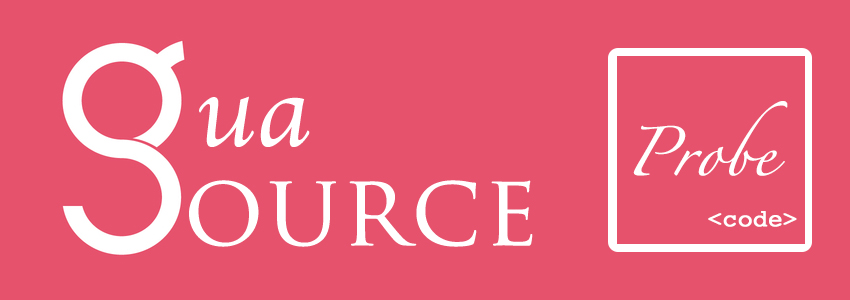

 

(图片设计：**[冬瓜](https://www.behance.net/gallery/41562273/Gua-iOS-Source-Prode)**）

## Description

为什么要做这个仓库的原因，是为了促进自己阅读代码，从而巩固自身基础。从非科班出身、acm的错误洗礼下，本人需要认识更多的底层知识，从而纠正自己对*Computer Science*的观念。我将自己理解和阅读的一些源码、文档的笔记与博文与大家分享，接受希望大家的指正。倘若你有兴趣和我一起来阅读源码并分享阅读笔记，可以发起`pull request`。

如有疑问，可以在issue中发起。讨论得出结论，才能获得进步。

本仓库的源码分享暂时以*Objective-C*、*Swift*、*C++*、*C*、*Python*为主，这些是笔者日常接触的语言。如果想与笔者交流，可以关注新浪微博 [@冬瓜争做全栈瓜](http://weibo.com/3633493894/profile?topnav=1&wvr=6)

另外，也可以访问作者个人blog来阅读：[http://desgard.com](https://desgard.com/)

## Content

Language | Framework | Version | Article
----- | --------- | ------ | --------
Objective-C | `<objc/runtime.h>` | | [浅谈Associated Objects](https://github.com/Desgard/iOS-Source-Probe/blob/master/Objective-C/Runtime/%E6%B5%85%E8%B0%88Associated%20Objects.md) [objc_msgSend消息传递学习笔记 - 对象方法消息传递流程](https://github.com/Desgard/iOS-Source-Probe/blob/master/Objective-C/Runtime/objc_msgSend%E6%B6%88%E6%81%AF%E4%BC%A0%E9%80%92%E5%AD%A6%E4%B9%A0%E7%AC%94%E8%AE%B0%20-%20%E5%AF%B9%E8%B1%A1%E6%96%B9%E6%B3%95%E6%B6%88%E6%81%AF%E4%BC%A0%E9%80%92%E6%B5%81%E7%A8%8B.md) [objc_msgSend消息传递学习笔记 - 消息转发](https://github.com/Desgard/iOS-Source-Probe/blob/master/Objective-C/Runtime/objc_msgSend%E6%B6%88%E6%81%AF%E4%BC%A0%E9%80%92%E5%AD%A6%E4%B9%A0%E7%AC%94%E8%AE%B0%20-%20%E6%B6%88%E6%81%AF%E8%BD%AC%E5%8F%91.md) [浅谈 block（1） - clang 改写后的 block 结构](https://github.com/Desgard/iOS-Source-Probe/blob/master/Objective-C/Runtime/%E6%B5%85%E8%B0%88%20block%EF%BC%881%EF%BC%89%20-%20clang%20%E6%94%B9%E5%86%99%E5%90%8E%E7%9A%84%20block%20%E7%BB%93%E6%9E%84.md)
Objective-C | Foundation | | [从经典问题来看 Copy 方法](https://github.com/Desgard/iOS-Source-Probe/blob/master/Objective-C/Foundation/%E4%BB%8E%E7%BB%8F%E5%85%B8%E9%97%AE%E9%A2%98%E6%9D%A5%E7%9C%8B%20Copy%20%E6%96%B9%E6%B3%95.md)

## Errata

可以发起issue或者pull request进行勘误。

## The MIT License (MIT)

Copyright (c) 2016 Desgard_Duan

Permission is hereby granted, free of charge, to any person obtaining a copy
of this software and associated documentation files (the "Software"), to deal
in the Software without restriction, including without limitation the rights
to use, copy, modify, merge, publish, distribute, sublicense, and/or sell
copies of the Software, and to permit persons to whom the Software is
furnished to do so, subject to the following conditions:

The above copyright notice and this permission notice shall be included in all
copies or substantial portions of the Software.

